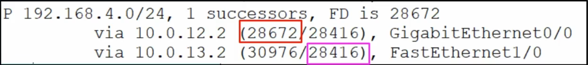

# RIP & EIGRP

## RIP

- **Routing Information Protocol** (RIP)
- Industry standard protocol
- Distance Vector
- Metric: Hop count
  - Maximum hop count of 15
- Three versions
  - **RIPv1** and **RIPv2** for use with IPv4
  - **RIPng** (RIP Next Generation) for use with IPv6
- Two message types
  - **Request**: Ask RIP-enabled neighbour routers to send their routing table
  - **Response**: To send the local router's routing table to a neighbour router
- By default, routing table is shared every 30 seconds

### RIPv1 and RIPv2

- RIPv1
  - Only advertises *classful* addresses
  - Doesn't support VLSM or CIDR
  - Doesn't include subnet mask information in advertisements
  - Messages are broadcast to 255.255.255.255
- RIPv2
  - Supports VLSM and CIDR
  - Includes subnet mask information in advertisements
  - Messages are **multicast** to 244.0.0.9

### `network` command

The **`network`** command tells the router to:

- Look for interfaces with an IP address that is in the specified range
- Activate RIP on the interfaces that fall in the range
- Form adjacencies with connected RIP neighbours
- Advertise the network prefix of the interface
- Not the prefix in the network command
- Examples at [RIP Config](#rip---config)
- The command is classful, so:
- The router will check its own interfaces for IP addresses that match
  - `network 10.0.0.0` will enable both 10.10.0.0 and 10.0.12.0
- The router will advertise the network prefix of those interfaces
  - NOT the prefix of the address provided
  - 10.10.0.0/30 not 10.0.0.0/8

## EIGRP

- **Enhanced Interior Gateway Routing Protocol** (EIGRP)
- *Cisco proprietary*
  - It was, but has mostly been published
  - Not widely adopted, mostly seen only on Cisco devices
- Considered to be an 'advanced - hybrid" distance vector routing protocol
  - Faster than RIP in responding to changes in the network
  - No 15 hop-count limit
- The router will advertise by using a multicast address to 224.0.0.10
- The only IGP capable of performing **unequal**-cost load-balancing
  - The router can send more traffic over a lower metric bandwidth (faster connection)
  - By default it performs ECMP load-balancing over 4 paths (like RIP)
- The router will have a unique router ID to identify it on the network
  - The determine the router ID, the router will use one of the following (in order of priority):
    - Manual configuration
  - Highest IP address on a loopback interface
  - Highest IP on a physical interface
  - Note: this value is not actually an IP address, but a 32-bit number formatted as dotted decimal

### Wildcard masks

- EIGRP can use wildcard masks instead of subnet or network masks
- Essentially an inverted subnet mask
- All 1s in the subnet mask are 0 in the equivalent wildcard mask
  - Thus, all 0s are 1 in the equivalent wildcard mask
- A 0 in the wildcard mask mean it must match
  - ie. 172.16.1.0 0.0.0.15
    - This wildcard mask in binary is 00000000.00000000.00000000.00001111
  - The first 3 octets and the first 4 bits must match

### EIGRP Metric

- **metric = `bandwidth` + `delay`**
  - The bandwidth of the **slowest link** + the delay of **all links**
    - If there are 3 links and one is a 'fast ethernet', this slowest delay is added to all three links
  - There is more to it than this, but that is for a future certification
- **Important Terminology**
  - **While the term distance is used. It is actually the metric. This is unrelated to Administrative Distance**
  - `Feasible Distance` (FD): This router's metric value to the route's destination.
    - This is the metric of the whole route
      - (R1 -> R2 -> R4 -> Connected Network)
    - The left-hand value from `show ip eigrp topology`
  - `Reported Distance`: The neighbour's metric value to the route's destination.
    - aka Advertised Distance
    - This is the metric as reported by the neighbour interface
      - ((R1) R2 -> R4 -> Connected Network)
    - The right-hand value from `show ip eigrp topology`
  - `Successor`: The route with the lowest metric to the destination
    - ie The best route
  - `Feasible Successor`: An alternate route to the destination *which meets the feasibility condition*
    - ie Not the best route, but complete
  - `Feasibility Condition`: A route is considered a **feasible successor** if it's **reported distance** is lower than the **successor** route's **feasible distance**.
    - The next route's right-hand number (pink) is less than the current route's left-hand number (red).
    - The feasibility condition is a loop prevent mechanism.
      - Any route that meets the feasibility condition to become a feasible successor won't create a loop.

### Unequal Cost Load Balancing

- EIGRP achieves UCMP by configuring the `variance` value.
- The `variance` value is used as a multiplier the **Successor's FD**
  - By default it is set to `1` and only **feasible successor** routes with an FD equal to the FD of the **successor** can be used.
  - Setting the `variance` to `2` will allowed for traffic to load-balanced across **feasible successor** with an FD of twice the value of the **successor's FD**

## Configuration

### RIP - Config

- Show routing protocol information
  - `R1#show ip protocols`
- Enter router config mode
  - `R1(config)#router rip`
- Set the version
  - Always ensure v2 is used
  - `R1(config-router)#version 2`
- Turn off auto-summary
  - Stops the router from auto-resolving to classful addresses
  - `R1(config-router)#no auto-summary`
- Activate RIP on interfaces
  - `R1(config-router)#network 10.0.0.0`
  - `R1(config-router)#network 172.16.0.0`
  - **Note**: No netmask
  - See [`network` command](#network-command)
- Stop interfaces from sending advertisements
  - `R1(config-router)#passive-interface g2/0`
- Advertise the default route
  - `R1(config-router)#default-information originate`

### EIGRP - Config

- Show routing protocol information
  - `R1#show ip protocols`
- Enter router config mode
  - `R1(config)#router eigrp 1`
  - `1` is the AS number and must match between routers
- Turn off auto-summary
  - `R1(config-router)#no auto-summary`
- Activate EIGRP on interfaces
  - `R1(config-router)#network 10.0.0.0`
  - `R1(config-router)#network 172.16.1.0 0.0.0.15`
  - See [Wildcard masks](#wildcard-masks)
- Stop interfaces from sending advertisements
  - `R1(config-router)#passive-interface g2/0`
- Set the router ID
  - `R1(config-router)#eigrp router-id <value>`

#### Lab Config

- Show routing information sources
  - `R1#show ip eigrp neighbors`
- Show detailed information of the EIGRP routes
  - `R1#show ip eigrp topology`
  - This will display all the routes received and only the best ones are displayed in `show ip route eigrp`
- Configure variance for UCMP
  - `R1(config-router)#variance <value>`
