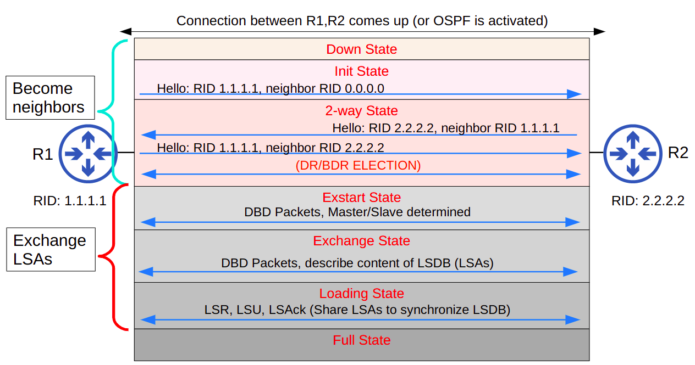

# Open Shortest Path First

## Part 1

- **Dijkstra's Algorithm**
  - Shortest Path First (SPF) algorithm
- Three versions of OSPF
  - OSPFv1
    - 1989. Old and not in use anymore
  - OSPFv2
    - 1998. Used for IPv4
    - The focus of CCNA and this lecture
  - OSPFv3
    - 2008. Used for IPv6
      - Can also be used for IPv4, but v2 is usually used
- **Link State Advertisements** (LSAs) store information about the network
  - Each LSA has an aging timer of 30 min by default
  - The LSA will be flooded when expired
- **Link State Database** (LSDB) organises and stores LSAs.
- Routers will **flood** LSAs until all routers in the OSPF **area** develop the same map of the network

### Sharing LSAs

1. **Become neighbours**
    - Become neighbours with other routers connected to the same segment.
    - The routers don't have to be directly connected
2. **Exchange LSAs**
    - Exchange LSAs with each neighbour router until every router has all of the LSAs
    - These are stored and organised in the LSDB
3. **Calculate the best routes**
    - The best route to each destination is calculated and added to the routing table

### OSPF Areas

- OSPF divides the network into areas
  - A small network can use a single area without any negative effects
  - Larger networks using a single area will have performance impacts
    - The SPF algorithm will take more time to calculate the routes
    - The SPF algorithm will require much more processing power on each router
    - The larger LSDB will take up more memory on each router
    - Any small change to the network causes every router to flood LSAs and perform the SPF calculation
- An **area** is a set of routers and links that share the same LSDB
  - All OSPF areas should be contiguous
  - All OSPF areas must have at least one ABR
  - All interfaces in the same subnet must be in the same area
- The **backbone area** (area 0) is the area all other areas must connect to
- **Backbone Routers** are any router connected to the backbone area
- **Internal Routers** are those with all interfaces in the same area
- **Intra-area Route** are routes to a destination inside the same OSPF area
- **Area Border Routers** (ABRs) are routers with interfaces in multiple areas
  - ABRs maintain a separate LSDB for each area they are connected to
  - ABRs should be connected to no more than 2 areas
- **Inter-area route** are routes to a destination in a different OSPF area

## Part 2

### OSPF Cost

- OSPF's metic is called **cost**
- Calculated based on the bandwidth of the interface
  - **Cost** = **Reference** / **Interface-Bandwidth**
    - The default reference is 100 mbps
    - All values less than 1 will be converted to 1
    - All FastEthernet, Gigabit, 10-Gig, etc will have a cost of 1 (by default)
  - The **Reference** can be changed with:
    - `R1(config-router)# auto-cost reference-bandwidth <mbps>`
    - A good rule of thumb is to use a value '1-up' from your current max speed
      - ie. 1 gbps, use 10 gbps
    - **Ensure the new reference bandwidth is the same on all routers**
- All loopback interfaces have a cost of 1
- The interface-bandwidth can be changed
  - **NOT RECOMMENDED**
    - Used in other calculations
  - `R1(config-if)#bandwidth <kbps>`
- The cost can be manually configured with:
  - `R1(config-if)#ip ospf cost <cost>`

### OSPF Neighbour States

- Making sure that router successfully become OSPF neighbours is the main task in configuring and troubleshooting OSPF
- Once routers become neighbours, they do all the work of sharing network information
- When OSPF is first activated:
  - The routers starts sending OSPF **hello** packets out of the interface
    - Default **hello timer** is 10 seconds
    - Multicast to `224.0.0.5`
    - Encapsulated in IP packets with `89` in the Protocol field

#### Down State

- OSPF has just been activated on R1's G0/0 interface
- The interface sends an OSPF **hello** packet to `224.0.0.5`
- It doesn't know about any OSPF neighbours yet
  - Neighbour state is **Down**
- The **hello** packet contains:
  - My RID: `<router's ID>`
  - Neighbor RID: `0.0.0.0`
    - RID =  Router ID

#### Init State

- R2 receives the **hello** packet
- R1 is added to R2's OSPF neighbour table
  - Relationship is now **Init**
- **Init** state = **hello** packet received but own RID not in **hello** packet

#### 2-way State

- R2 responds with a **hello** packet containing the RID of both routers
- R1 will insert R2 into its OSPF neighbour table in the **2-way** state.
- R1 sends a **hello** packet containing both RIDs
- Both routers are now in the **2-way** state
- All conditions have been met to become OSPF neighbours
  - They are ready to share LSAs and build a common LSDB
- **If required**
  - This is where a DR (Designated Router) and a BDR (Backup Designated Router) will be elected.

#### Exstart State

- The routers exchange **DBD** (Database Description) packets to determine which will be the **Master** and which will be the **Slave**
  - This is to determine which router will initiate the exchange
  - The router with the higher RID will become the **Master**

#### Exchange State

- The routers again exchange **DBD** packets
  - This contains a list of LSAs in their LSDB
  - Only includes basic information
- The routers compare the information in the DBD packets they received to determine which LSAs they require from their neighbour

#### Loading State

- A router sends an **LSR** (Link State Request) packet to request missing LSAs
- LSAs are sent in an **LSU** (Link State Update) packet
- When an LSA has been received, a router responds with an **LSAck** packet

#### Full State

- The routers now have full OSPF adjacency and identical LSDBs
- They maintain neighbour adjacency by sending and receiving **hello** packets
  - 10 seconds default timer
- Each time a **hello** packet is received the **Dead** timer is reset
  - 40 seconds default
- The routers continue to share LSAs as the network changes to make sure each router has a complete and accurate map of the network within its LSDB.

#### Summary of OSPF Messages/Packets

| Type | Name                                          | Purpose                                                                                        |
|:----:|:---------------------------------------------:|:----------------------------------------------------------------------------------------------:|
| 1    | **Hello**                                     | Neighbour discovery and maintenance.                                                           |
| 2    | **Database Description** **(DBD)**         | Summary of the LSDB of the router. Used to check if the LSDB of each router is the same. |
| 3    | **Link-State Request** **(LSR)**           | Requests specific LSAs from the neighbour.                                                     |
| 4    | **Link-State Update** **(LSU)**            | Sends specific LSAs to the neighbour.                                                          |
| 5    | **Link-State Acknowledgement** **(LSAck)** | Used to acknowledge that the router received a message.                                     |

## Part 3

## Configuration

### Part 1 - Configuration

- Show OSPF configuration
  - `R1#show ip protocols`
- Enable OSPF on the router
  - `R1(config)#router ospf <process ID>`
    - The process ID does not have to be the same between each router
  - `R1(config-router)#network <IP> <wildcard mask> area <OSPF area>`
    - This will enable OSPF on the interfaces in the IP range
    - This router will now try to become neighbours with other OSPF-activated routers
- Stop an interface from sending `hello` messages
  - `R1(config-router)#passive-interface <interface ID>`
    - Neighbours won't be formed with devices connected to this interface
    - LSAs for the subnet connected to this interface will still be sent from other interfaces
      - Assuming this interface was enabled with `network`
- Advertise the default route
  - `R1(config-router)#default-information originate`
- Configure the Router ID
  - `R1(config-router)router-id A.B.C.D`
  - `R1#clear ip ospf process`
    - Note. Command is at the priv-exec level, not router-config (can use `do`)
- Configure number of paths to load balance
  - `R1(config-router)#maximum-paths <1-32>`
- Configure the Administrative Distance for OSPF
  - `R1(config-router)#distance <value>`

### Part 2 - Configuration

- Show detailed OSPF configuration settings for an interface
  - `R1#show ip ospf interface <intID>`
- Show OSPF neighbour details
  - `R1# show ip ospf neighbor`
- Modify the OSPF cost:
  - Change the **reference bandwidth** (ensure this is the same across all OSPF neighbours)
    - `R1(config-router)#auto-cost reference-bandwidth <mbps>`
  - Configure the interface cost of an interface manually
    - `R1(config-if)#ip ospf cost <cost>`
  - Change the interface bandwidth **NOT RECOMMENDED**
    - `R1(config-if)#bandwidth <kbps>`
- Directly activate OSPF on an interface
  - `R1(config-if)#ip ospf <process ID> area <OSPF area>`
- Configure all interfaces as passive
  - `R1(config-router)#passive-interface default`
  - `R1(config-router)#no passive-interface <intID>`
