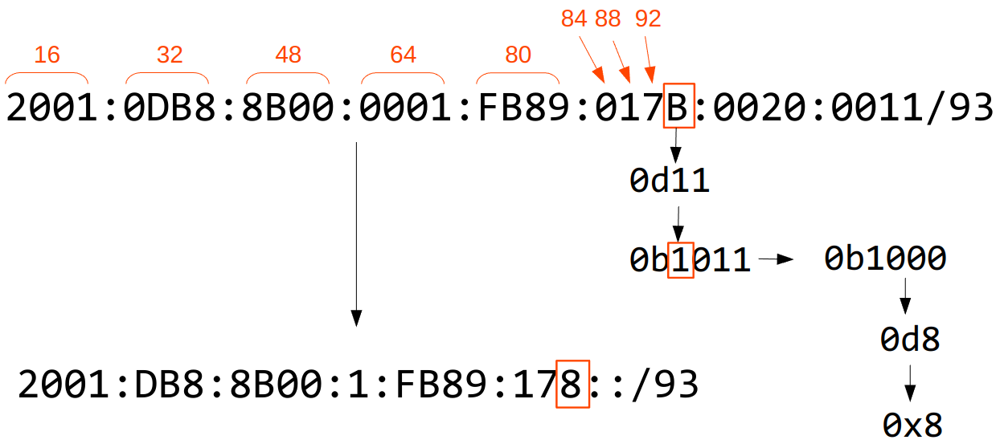
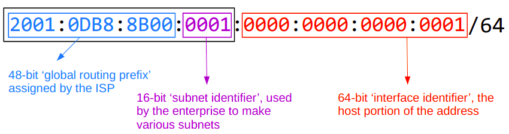
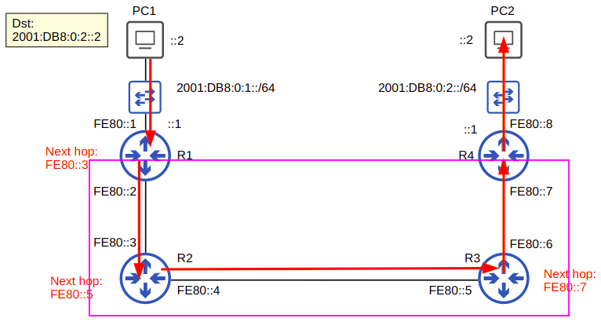
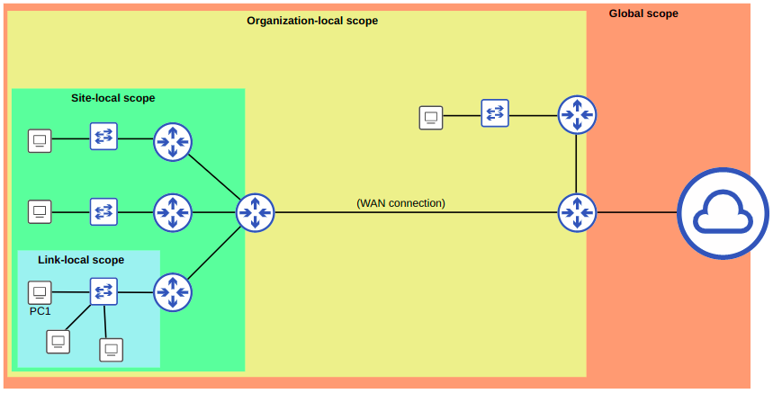
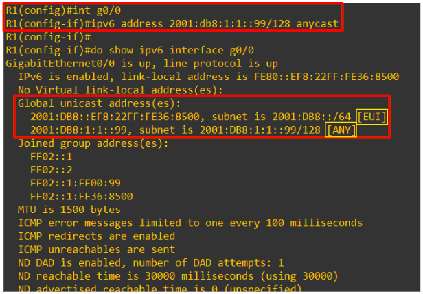

# IPv6

## Part 1

- IPv6 is being implemented due to the shortage of IPv4 addresses
  - Approx 4.2 billion IPv4 addresses (2<sup>32</sup>)
  - VLSM, private IPv4 addresses and NAT have been used to conserve IPv4 addresses
    - All short-term solutions
    - Long-term solution is to go to IPv6
- IPv4 address assignments are controlled by IANA
  - Internet Assigned Numbers Authority
- IPv6 address is **128 bits**
  - 2<sup>128</sup> number of addresses
    - 340 with 12 trailing 0s
- An IPv6 address is written as eight quartets of hex characters
  - `2001:0DB8:5917:EABD:6562:17EA:C92D:59DB`
  - Addresses can be shorted by:
    - Removing leading 0s
      - `2001:0DB8:000A:001B:20A1:0020:0080:34BD` -> `2001:DB8:A:1B:20A1:20:80:34BD`
    - Replacing consecutive 0s with a double colon (::)
      - `2001:0DB8:0000:0000:0000:0000:0080:34BD` -> `2001:0DB8::0080:34DB`
      - Consecutive quartets of 0s can only be abbreviated once in an IPv6 address
    - Both methods can be combined
      - `2001:0DB8:0000:0000:0000:0000:0080:34BD` -> `2001:0DB8::0080:34DB` -> `2001:DB8::80:34DB`
  - Addresses can be expanded by doing the opposite:
    - Put leading 0s where needed (fill each quartet to 4 hexadecimal characters)
      - `FE80::2:0:0:FBE8` -> `FE80::0002:0000:0000:FBE8`
    - Replace all double colons with all-0 quartets, ensuring 8 quartets in total
      - `FE80::0002:0000:0000:FBE8` -> `FE80:0000:0000:0000:0002:0000:0000:FBE8`

### Finding the IPv6 prefix (global unicast addresses)

- Typically, an enterprise requesting IPv6 addresses from their ISP will receive a /48 block
- Typically, IPv6 subnets use a /64 prefix length
- This means an enterprise has 16 bits to use to make subnets
- The remaining 64 bits can be used for hosts

```txt
|2001:0DB8:8B00| : |0001| : |0000:0000:0000:0001| /64

The first three quartets (48-bits)
    2001:0DB8:8B00
Are used as the 'global routing prefix' and are assigned by the ISP

The next quartet (16-bits)
    0001
Are used as the 'subnet identifier', used by the enterprise to make various subnets

The last four quartets (64-bits)
    0000:0000:0000:0001
Are used as the 'interface identifier', the host portion of the address
```

- If the 'slash prefix' is a multiple of 4, just count the number of characters
  - Remember each quartet is 16 bits
- If the 'slash prefix' is not a multiple of 4 and the count will end 'inside' a character
  1. Convert the character to binary
  2. Count the required number of extra bits
  3. Replace all bits after the required with 0s
  4. Convert back to hexadecimal



## Part 2

### EUI-64

- **Extended Unique Identifier**
  - Method to covert a MAC address to a 64-bit interface identifier
    - This can then be used to become the 'host portion' of a /64 IPv6 address
  - How to convert the MAC address
    1. Split the MAC address in half
        - `1234 5678 90AB` -> `1234 56 | 78 90AB`
    2. Insert `FFFE` in the middle
        - `1234 56FF | FE78 90AB`
    3. Invert the 7th bit
        - The `2` contains the 7th bit
        - `0x2` == `0010` and the third value is the 7th bit
          - The `1` in this case
        - `0010` -> `0000` == `0x2` -> `0x0`
        - `1234 56FF | FE78 90AB` -> `1034 56FF | FE78 90AB`
        - This can now be added to the end of an IPv6 prefix

### Address Types

#### Global Unicast

- IPv6 addresses are public address which can be used over the internet
- Must register to use them
  - They are public and expected to be unique
- Defined as "All addresses not reserved for other purposes"



---

#### Unique Local

- Private IPv6 addresses which cannot be used over the internet
- No need to register and cannot be routed over the internet
  - The global ID portion should be randomised/unique so address won't overlap when companies merge
- Uses the address block `FD00::/8`
  - `FD00::` to `FDFF:FFFF:FFFF:FFFF:FFFF:FFFF:FFFF`


---

#### Link Local

- Link-local IPv6 addresses are automatically generated on **ALL** IPv6 enabled interfaces
- Uses the address block `FE80::/10`
  - However the standard states the 54-bits following `FE80` should be all 0
  - You won't see link local addresses beginning with `FE9`, `FEA`, or `FEB`. Only `FE8`
- These addresses are generated using the EUI-64 rules
- The addresses can only be used within the same subnet
  - Routers **will not** route packets destined for an IPv6 link local address
  - Routers will use link local address for routing, as the next hop
    - ie. can be used to route traffic, but traffic cannot be routed to one of these addresses
    - The image below shows that traffic can be routed to/from PC1 and PC2, but neither can route traffic to the interfaces outside their subnet
- Common uses for Link Local addresses:
  - Routing protocol peering
    - OSPFv3 uses link-local addresses for neighbor adjacencies
  - Next-hop addresses for static routes
  - *Neighbor Discovery Protocol* (NDP) uses link local address to function
    - NDP is IPv6's replacement for ARP



---

#### Other IPv6 Addresses

- `::`
  - The *unspecified* IPv6 address
  - Can be used when a device doesn't yet know it's IPv6 address
  - IPv6 default routes are configured to `::/0`
    - IPv4 equivalent is `0.0.0.0`
- `::1`
  - The IPv6 loopback address
  - IPv4 equivalent is the `127.0.0.1/8` address range

### Multicast Addresses

- IPv6 uses the range `FF00::/8` for multicast addresses
- IPv6 **does not use broadcast**
  - Instead has an "All nodes/hosts" multicast address
    - `FF02::1`

| **Purpose**                                   | **IPv6 Address** | **IPv4 Address** |
|:---------------------------------------------:|:----------------:|:----------------:|
| All nodes/hosts<br>(functions like broadcast) | FF02::1          | 224.0.0.1        |
| All routers                                   | FF02::2          | 224.0.0.2        |
| All OSPF routers                              | FF02::5          | 224.0.0.5        |
| All OSPF DRs/BDRs                             | FF02::6          | 224.0.0.6        |
| All RIP routers                               | FF02::9          | 224.0.0.9        |
| All EIGRP routers                             | FF02::A          | 224.0.0.10       |

**Note**: The final value is the same in IPv6 and IPv4 (0xA == 0d10)

#### Multicast Address Scopes

- IPv6 defines multiple multicast 'scopes'
  - Each indicates how far the packet should be forwarded
    - The addresses in the above table all use the 'link-local' scope (`FF02`) and stay on the local subnet
- IPv6 scopes are:
  - **Interface-local** (`FF01`)
    - The packet doesn't leave the local device
    - This is different from a loopback address and usually only used in embedded systems
  - **Link-local** (`FF02`)
    - The packet remains on the local subnet
    - Routers will not route the packet between subnets
  - **Site-local** (`FF05`)
    - The packet can be forwarded by routers
    - Should be limited to a single physical location (not forwarded over WAN)
    - Must be configured by a network engineer
  - **Organization-local** (`FF08`)
    - Wider in scope than site-local
    - Usually an entire company
    - Must be configured by a network engineer
  - **Global** (``FF0E`)
    - No boundaries
    - Possible to be routed over the internet
      - Doesn't mean it will be



### Anycast Addresses

- A new feature for IPv6
- Defined as "**One-to-one-of-many**"
  - Multiple routers are configured with the same IPv6 address
    - They will use a routing protocol to advertise this address
    - Hosts will send packets to this address and it will be forwarded to the nearest router
      - Nearest as based on routing metric
- There is no specific address range for anycast addresses
  - Use any regular unicast address and specify as an anycast address
    - `R1(config-if)#ipv6 address 2001:db8:1:1::99/128 anycast`



## Part 3

## Configuration

### Configuration - Part 1

- Show IPv6 interface details
  - `R1#show ipv6 interface brief`
- Allow the router to perform IPv6 routing
  - `R1(config)#ipv6 unicast-routing`
- Assign an IPv6 address
  - `R1(config)#int g0/0`
  - `R1(config-if)#ipv6 address 2001:db8::1/64`
    - Note: any method of shortening can be used. The router will know
  - `R1(config-if)#no shutdown`

### Configuration - Part 2

- Configure an EUI-64 address
  - `R1(config)#int g0/0`
  - `R1(config-if)#ipv6 address 2001:db8::/64 eui-64`
  - `R1(config-if)#no shutdown
