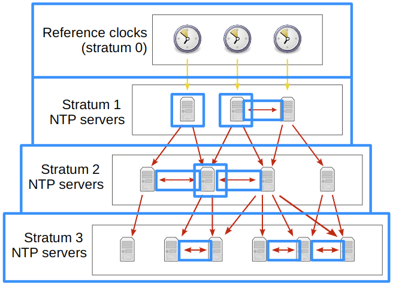

# Network Time Protocol

- All devices have an internal clock
  - Vital for accurate logs for events
- Cisco devices have two internal clocks
  - Software (`clock`)
    - This timestamp is used in logs
  - Hardware (`calendar`)
    - This is used to set the software clock on boot
    - Will drift over time
- Both internal clocks can be synchronised either way
- Timezone and daylight savings can be configured

## Network Time Protocol (NTP)

- Manually configuring clocks is not scalable
- NTP allows automatic syncing of time over a network
  - NTP clients request time from NTP servers
  - A device can be an NTP server and client at the same time
- NTP uses `UDP port 123` to communicate
- Some NTP servers are 'better' than others.
  - The 'distance' of an NTP server from the original **reference clock** is called **stratum**
- NTP only uses UTC time.
  - You must configure the timezone on each device

### Reference clocks and the NTP Hierarchy

- A reference clock is usually a very accurate time device
  - Atomic clock or GPS clock
- Reference clocks are **stratum 0**
  - Servers directly connected to reference clocks are **stratum 1**
  - **Stratum 15** is the maximum
    - Anything above this is considered unreliable
- Devices can also *'peer'* with devices at the same stratum to provide a more accurate time
  - Known as **symmetric active** mode
- An NTP client can sync to multiple NTP servers

- NTP servers which get their time directly from reference clocks are also called **primary servers**
- NTP servers which get their time from other NTP servers are called **secondary servers**
  - These secondary servers operate in both server and client mode at the same time

## Configuration

### Manual Configuration

- Show the software clock
  - `R1#show clock`
  - `R1#show clock detail`
    - The asterisks (*) is to show the time is not considered authoritative
- Show the hardware clock
  - `R1#show calendar`
  - `R1#show calendar detail`
- Set the clocks
  - `R1#clock set hh:mm:ss dd MONTH yyyy`
  - `R1#calendar set hh:mm:ss dd MONTH yyyy`
- Synchronise clocks
  - `R1#clock update-calendar`
  - `R1#clock read-calendar`
- Configure timezone
  - `R1(config)#clock timezone <timezone name> <hours to offset>`
- Configure daylight savings / summertime
  - `R1(config)#clock summer-time <timezone name> {recurring | date} <Start of DST> <End of DST>`
    - It's a long command use the `?` to ensure selection is correct

### NTP Configuration

- Show the NTP configuration
  - `R1#show ntp status`
- Set the server(s) to receive time from
  - `R1(config)#ntp server <ip address> [prefer]`
    - More than one server can be set
- Show the NTP associations
  - `R1#show ntp associations`
- Configure the NTP server as master
  - `R1(config)#ntp master <stratum>`
    - 8 is the stratum default
  - `R1(config)#ntp source <interface>`
    - Clients will not connect unless a source interface is set
- **Configure authentication**
  - Enable authentication
    - `R1(config)#ntp authenticate`
  - Create auth key
    - `R1(config)#ntp authentication-key <key-number> md5 <key/password>`
  - Specify the trusted key
    - `R1(config)#ntp trusted-key <key-number>`
  - Specify which key to use for the server/peer
    - `R1(config)#ntp server <ip> key <key-number>`
    - `R1(config)#ntp peer <ip> key <key-number>`
- Configure NTP to update the calendar (hardware clock)
  - `R1(config)#ntp update-calendar`
