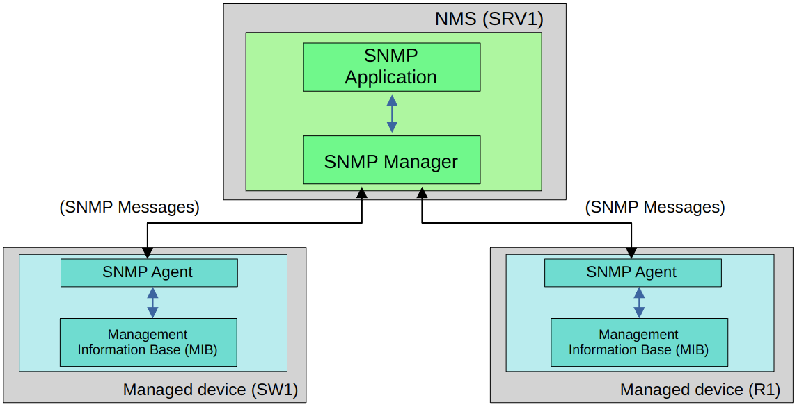

# Simple Network Management Protocol

## Lecture Notes

- An industry standard framework and protocol used to manage network devices
- Can be used to:
  - Monitor the status of devices
  - Make configuration changes
  - Monitor the uptime of interfaces/devices
- Two main device types of devices in SNMP
  - **Managed Devices**
    - The devices being managed using SNMP
  - **Network Management Station (NMS)**
    - The device/devices managing the manged devices
    - Not necessarily a server, more likely to be a sys-admin's workstation
- Three main operations used in SNMP
  1. Managed devices can notify the NMS of evens
  2. The NMS can ask the managed devices for information about their current status
  3. The NMS can tell the managed devices to change aspects of their configuration

### SNMP Components

- Network Management Station
  - **SNMP Application**
    - Provides an interface for the network admin to interact with
      - Displays alerts, charts, statistics, etc
  - **SNMP Manager**
    - The software on the NMS that interacts with the managed devices
      - Receives notifications, sends requests for information etc.
- Managed Device
  - **SNMP Agent**
    - The SNMP software running on the managed devices that interacts with the SNMP Manager on the NMS
      - Sends notifications to the NMS
      - Receives messages from the NMS
  - **Management Information Base (MIB)**
    - The structure that contains the variables that are managed by SNMP
      - Each variable is identified with an Object ID (OID)
        - Examples are: Interface status, traffic throughput, CPU usage, temperatures, etc.

### SNMP Versions

- There are three major versions that have achieved wide-spread use:
  - **SNMPv1**
    - The original version of SNMP
    - Probably the only version that can be called "simple"
  - **SNMPv2c**
    - Allows the NMS to retrieve large amounts of information in a single request, so it is more efficient
    - '*c*' refers to 'community strings' used as passwords
  - **SNMPv3**
    - A much more secure version of SNMP
    - Supports strong **encryption** and **authentication**
    - This version should be used when possible

### SNMP Messages

- **Read**
  - Messages sent by the NMS to read information from the managed device
  - *Get*
    - A request from the manager to the agent to retrieve the value of a variable (OID) or multiple variables.
    - The agent will send a *Response* message with the current value of each variable
  - *GetNext*
    - A request from the manager to the agent to discover the available variables in the *Management Information Base (MIB)*
  - *GetBulk*
    - A more efficient version of the *GetNext* message (introduced in SNMPv2)
- **Write**
  - Messages sent by the NMS to change information on the managed device
  - *Set*
    - A request sent from the manager to the agent to change the value of one or more variables
    - The agent will send a *Response* message with the new values
- **Notification**
  - Messages sent by the managed devices to alert the NMS of a particular event
  - *Trap*
    - A notification sent from the agent to the manager
    - The manager does **NOT** send a *Response* message to acknowledge that it received the *Trap*
    - These messages are 'unreliable'
  - *Inform*
    - A notification message that is acknowledged with a *Response* message
    - Originally used for communications between managers, but later updates allow agents to send *Inform* messages to managers
- **Response**
  - Messages sent in response to a previous message/request

A reminder of the ports used:

- SNMP Agent = UDP 161
- SNMP Manager = UDP 162

## Configuration

- Configure optional information
  - `R1(config)#snmp-server contact <email>`
  - `R1(config)#snmp-server location <description>`
- Configure the SNMP community strings (passwords)
  - `R1(config)#snmp-server community <string> ro`
    - ro = read only = no *Set* messages
  - `R1(config)#snmp-server community <string> rw`
    - rw = read/write = can use *Set* messages
- Specify the NMS, version and community
  - `R1(config)#snmp-server host <NMS ip> version <SNMP version (2c)> <community string>`
- Configure the Trap types to send to the NMS
  - `R1(config)#snmp-server enable traps <trap type1, trap type2 etc.>`
