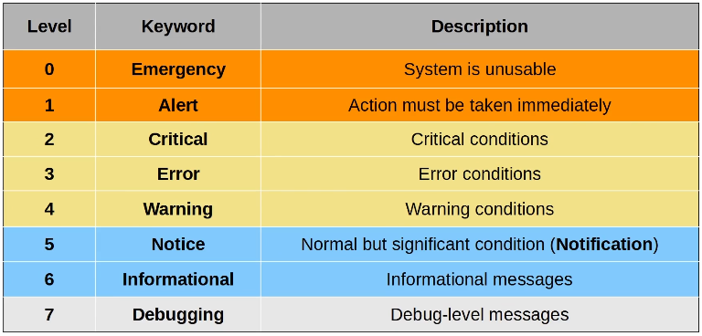

# Syslog

## Lecture

### Overview

- Syslog is an industry standard protocol for message logging
- Used to log events on a device
  - Interface changes, OSPF neighbour status, system restarts, etc
- The messages can be displayed in the CLI, saved in the devices RAM or sent to an external Syslog server
- Logs are essential when troubleshooting or examining the cause of issues or incidents

#### Syslog vs SNMP

- Syslog and SNMP are both used for monitoring and troubleshooting of devices
- They are complementary but their functions are different
- **Syslog** is used for message logging
  - Events that occur within the system are categorised based on facility/severity and logged
  - Used for system management, analysis, and troubleshooting
  - Messages are sent from the device to the server
    - The server **cannot** actively pull information from the devices or modify variables
      - Think, SNMP Get or Set
- **SNMP** is used to retrieve and organise information about the SNMP managed devices
  - IP addresses, current status, temperature, CPU usage, etc
  - SNMP servers can use keyword commands to query or modify variables on the managed devices
    - Again, SNMP Get or Set

### Syslog Message Format

**`seq:time stamp: %facility-severity-MNEMONIC:description`**

- **seq**: A sequence number indicating the order/sequence of messages
- **time stamp**: A timestamp indicating the time the message was generated
- **facility**: A value that indicates which process on the device generated the message
- **severity**: A number that indicates the severity of the logged event
- **MNEMONIC**: A short code for the message, indicating what happened
- **description**: Detailed information about the event being reported
- *Note*: The seq and timestamp fields are optional and depend on the devices configuration

- **E**very **A**wesome **C**isco **E**ngineer **W**ill **N**eed **I**ce-cream **D**aily
  1. Emergency
  2. Alert
  3. Critical
  4. Error
  5. Warning
  6. Notification
  7. Informational
  8. Debugging

### Syslog Logging Locations

- **Console line**
  - Syslog messages will be displayed in the CLI when connected to the device via the console port
  - By default, all messages (level 0 - level 7) are displayed
- **VTY lines**
  - Syslog messages will be displayed in the CLI when connected to the device via *Telnet/SSH*
  - Disabled by default
    - Even if `logging monitor <level>` is enabled
    - To display messages `terminal monitor` must be entered
    - Only active for that session. Must be used every time you connect to a device via Telnet or SSH.
- **Buffer**
  - Syslog messages will be saved to RAM
  - By default, all messages (level 0 - level 7) are saved.
  - Viewed with `show logging`
- **External Server**
  - The device can be configured to send Syslog messages to an external server
  - Syslog server will listen for messages on UDP port 514

## Configuration

- Configure logging to location and severity level
  - `R1(config)#logging console <level>` - to console
  - `R1(config)#logging monitor <level>` - to vty lines
  - `R1(config)#logging buffered <buffer size in bytes> <level>` - to RAM/buffer
  - `R1(config)#logging host <ip>` - to external server
  - `R1(config)#logging <ip>` - to external server (same as above)
  - `R1(config)#logging trap <level>` - sets the severity level for external server
- Enable timestamps
  - `R1(config)#service timestamps log {datetime | uptime}`
    - Datetime is a timestamp with date and time (use this)
    - Uptime is a timestamp from how long the device has been active for
- View the logging when connect via SSH/Telnet (only lasts until end of session)
  - `R1#terminal monitor`
- Enable logging synchronous on the console (not vty)
  - `R1(config)#line console 0`
  - `R1(config-line)#logging synchronous`
