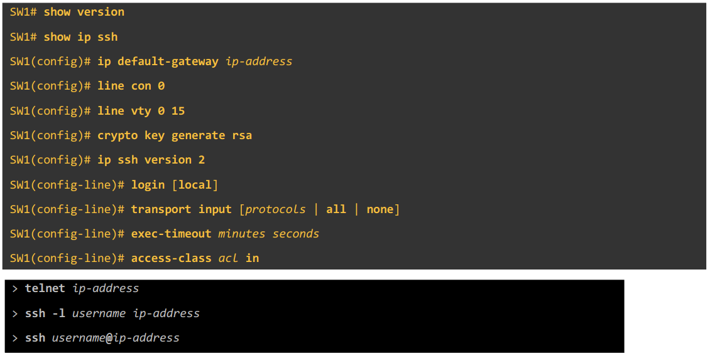

# Secure Shell

These notes will be different as the lecture was about configuring VTY services. Notes and configurations will be combined.

## Console port security

- By default, no password is needed to access the CLI of a Cisco IOS device via the console port
- A password can be configured on the console port by the following:

```cisco
# Enter line config mode. There is only a single console line, the number is always 0
R1(config)#line console 0

# Configure the console line's password
R1(config-line)#password <password>

# Require the device to enter the configured password to access the CLI via the console port
R1(config-line)#login
```

Alternatively, the console line can be configured to require users to login with a configured name and password.

```cisco
# Configure the username and password
R1(config)#username <username> secret <password>

# Enter line config mode.
R1(config)#line console 0

# Configure the device to require one of the configured logins
R1(config-line)#login local
```

## Layer 2 Switch

- Layer 2 switches don't perform packet routing and don't build a routing table
  - They aren't IP aware
- However, you can assign an IP address to an SVI to allow remote connections to the CLI of the switch
  - The connection will be made with SSH (or Telnet)

```cisco
# Enter interface configuration mode and configure an IP address
SW1(config)#interface vlan1
SW1(config-if)#ip address <ip> <netmask>
SW1(config-if)#no shutdown

# Return to global config mode and configure a default gateway
SW1(config-if)#exit
SW1(config)#ip default-gateway <ip>
```

## Telnet

- Old and insecure
- Packets are sent in plaintext
- Almost entirely replaced by SSH, but can be required for older hardware
- TCP port 23

```cisco
# A secret must be configured otherwise access to priv excec mode won't be allowed over telnet
SW1(config)#enable secret <password>

# Configure a username and password
SW1(config)#username <username> secret <password>

# Configure an ACL to limit which devices can connect to the VTY lines
SW1(config)#access-list <acl number> permit host <ip>

# Enter line configuration mode for all 16 vty lines
SW1(config)#line vty 0 15

# Configure the device to require one of the configured logins
SW1(config-line)#login local

# Configure the automatic timeout (inactivity logoff)
SW1(config-line)#exec-timeout <minutes> <seconds>

# Configure what type of connections are allowed to use the VTY lines, in this case we are configuring telnet
SW1(config-line)#transport input telnet

# Apply the configured ACL to the VTY lines
SW1(config-line)#access-class <acl> in
```

**NOTE** in the above we used `access-class`, this is only used when applying an ACL to VTY lines. `ip access-group` is used when applying an ACL to an interface.

## SSH

- If a device supports bother version 1 and version 2, it is said to run *'version 1.99'*
- TCP port 22
- IOS images that support SSH will have `'K9'` in their name.
  - Use `SW1#show version`
- Can see the current configuration of SSH with:
  - `SW1#show ip ssh`

```cisco
# To enable and use SSH, you must generate an RSA public and private key pair

# The FQDN of the device is used to name the RSA keys
SW1(config)#ip domain name <domain name>

# Generate the RSA keys, the length must be 768-bits or greater for SSHv2.
SW1(config)#crytpo key generate rsa
    Then follow the prompts
    OR
SW1(config)#crypto key generate rsa modulus <length>

# SSH has now been enabled

# A secret must be configured otherwise access to priv excec mode won't be allowed over SSH
SW1(config)#enable secret <password>

# Configure a username and password
SW1(config)#username <username> secret <password>

# Configure an ACL to limit which devices can connect to the VTY lines
SW1(config)#access-list <acl number> permit host <ip>

# (optional, but recommended) Restrict SSH to version 2 only
SW1(config)#ip ssh version 2

# (optional, but recommended) Enter line configuration mode for all 16 vty lines
SW1(config)#line vty 0 15

# Configure the device to require one of the configured logins
SW1(config-line)#login local

# (optional, but recommended) Configure the automatic timeout (inactivity logoff)
SW1(config-line)#exec-timeout <minutes> <seconds>

# Configure what type of connections are allowed to use the VTY lines, in this case we are configuring SSH
SW1(config-line)#transport input ssh

# Apply the configured ACL to the VTY lines
SW1(config-line)#access-class <acl> in
```

### SSH Configuration Summary

1. Configure hostname
2. Configure DNS domain name
3. Generate RSA key pair
4. Configure `enable secret` and `username <uname> secret <pword>`
5. (optional) Restrict to SSHv2
6. Configure VTY lines
   1. `login local`
   2. `excec-timeout`
   3. `transport input`
   4. `access-class <acl> in`
7. Connect with either:
   - `ssh -l <username> <ip address>`, or
   - `ssh <username>@i<ip address>`


