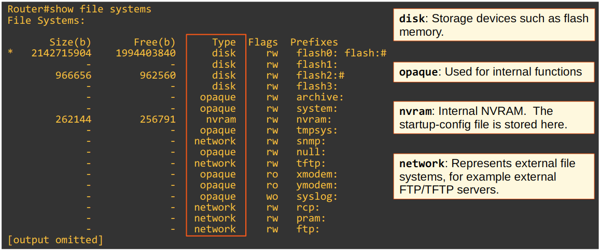
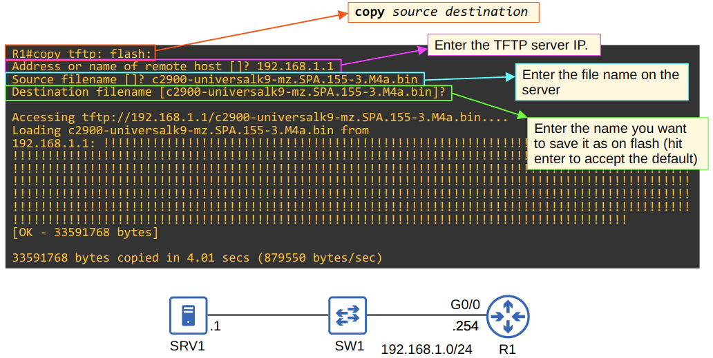
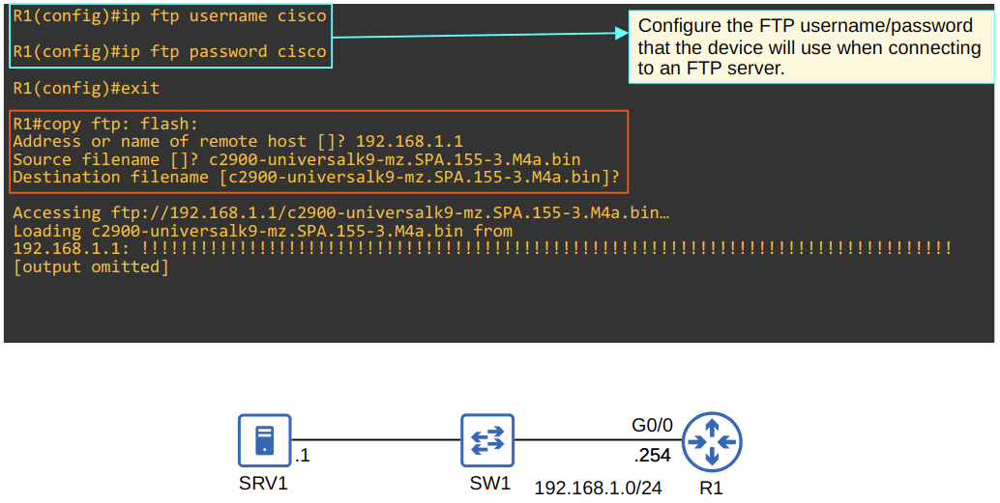
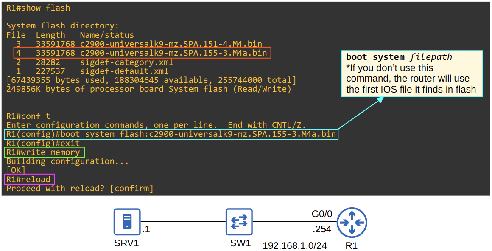
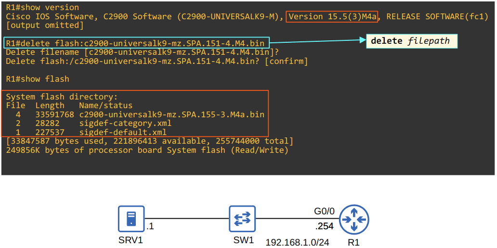

# File Transfer Protocol & Trivial File Transfer Protocol

## Lecture

- FTP and TFTP are industry standard protocols used to transfer files over a network
- The most common use for a network engineer is the process of upgrading the OS of a network device
  1. Get the new IOS image from Cisco
  2. Put the IOS on a server reachable by the device to be updated
  3. Use FTP/TFTP to copy into the flash memory of the device

### Trivial File Transfer Protocol

- Only has basic features
  - Can only copy a file to/from a server
  - Unable to list the directory, rename files, etc
- No authentication or encryption
- Connectionless, but with built-in features for reliability
  - Every TFTP data message is acknowledged
  - Timers are used, and if an expected message isn't received in time, the waiting device will resend its previous message
  - Called **"lock-step"** communication
    - The client and server alternately send a message and then wait for a reply
- TFTP listens on **UDP port 69**
- **TFTP 'Connections'**
  - TFTP file transfers have three phases:
  1. **Connection**: The TFTP client sends a request to the server, and the server responds back, initialising the connection
  2. **Data Transfer**: The client and server exchange TFTP messages. One sends data and the other sends acknowledgements
  3. **Connection Termination**: After the last data message has been sent, a final acknowledgement is sent to terminate the connection

### File Transfer Protocol

- Allows the client to navigate and list file directories, add and remove directories, etc
- Usernames and passwords are used for authentication
  - However, no encryption is used
- For greater security, there are modern alternatives:
  - **FTPS** (FTP over SSL/TLS)
    - This is an upgrade to FTP
  - **SFTP** (SSH File Transfer Protocol)
    - This is a "new" protocol, with a similar name
- There are two types of connections:
  - **FTP control (TCP 21)**: used to establish and send FTP commands and replies
  - **FTP data (TCP 20)**: used for transferring data
- There are two modes of data connection:
  - **Active**: The server will initiate the TCP connection for data transfer
    - This is the default method
  - **Passive**: The client will initiate the TCP connection for data transfer (at the server's instruction)
    - This is used when a firewall will block the incoming connection from the server

## IOS File Systems

View the file system with `R1#show file systems`

### Upgrading the Cisco IOS

- View the current version
  - `R1#show version`
- View the contents of flash
  - `R1#show flash`
- Using TFTP to copy a file to flash
  - `R1#copy tftp: flash:`

- Using FTP to copy a file to flash
  - Configure FTP credentials
    - `R1#(config)#ip ftp username <username>`
    - `R1#(config)#ip ftp password <password>`
  - Copy the file
    - `R1#copy ftp: flash:`

- Check the contents of flash and confirm the transferred filename
  - `R1#show flash`
- Set the IOS file to boot from
  - `R1(config)#boot system flash:<IOS file>`
- Return to priv exec mode and save the running configuration
  - If you don't save, the router will boot from the previously set file
  - `R1(config)#exit`
  - `R1#write memory`
- Reboot the device
  - `R1#reload`

- Delete the old IOS file
  - `R1#delete flash:<filepath>`

