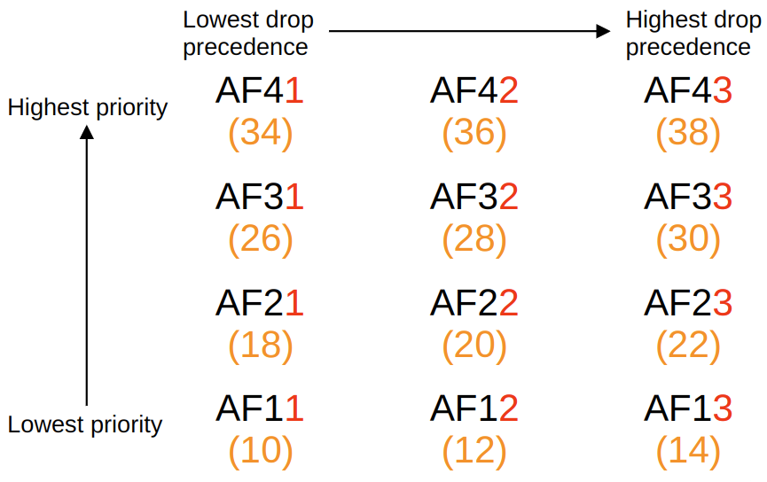

# Quality of Service

## IP Phones, Voice VLANs and Power over Ethernet

### IP Phones and Voice VLANs

- IP Phones use VoIP (Voice over IP) to enable calls over an IP network
  - IP phones are connected to a switch just like any other end host
- IP phones have an internal 3-port switch
  - 1 port is the 'uplink' to the external switch
  - 1 port is the 'downlink' to the PC
  - 1 port connects internally to the phone itself
  - This allows the PC and the IP phone to share a single switch port
- It is recommended to separate 'voice' traffic (from the IP phone) and 'data' traffic (form the PC) by placing them in separate VLANs
  - This can be accomplished using a *voice VLAN*
    - Traffic from the PC will be untagged
    - Traffic from the phone will be tagged with a VLAN ID
  - Although the interface sends/receives traffic from two VLANs, it is not considered a trunk port
  - It is considered an access port
  - `show interface <intID> trunk` will show the "Status" as "not-trunking"

### Power over Ethernet

- **Power over Ethernet** (POE) allows Power Sourcing Equipment (PSE) to provide power to Powered Devices (PD) over an ethernet cable
  - Typically the PSE is a switch and the PDs are IP phones, IP cameras, wireless access points, etc
  - The PSE receives AC power from the outlet, converts it to DC power and supplies that power to the PDs
- Too much electrical current can damage electrical devices
  - PoE has a process to determine how much power a connected device needs
    - When a device is connected to a PoE-enabled port, the PSE (switch) sends low power signals and monitors the response to determine how much power the PD needs, if at all
  - If the device needs power, the PSE supplies the power to allowed the PD to boot
  - The PSE continues to monitor the PD and supply the required amount of power
- *Power Policing* can be configured to prevent a PD from taking too much power
  - [Power Policing Configuration](#voice-vlans-and-poe---configuration)
  - `power inline police` configures power policing with the default settings
    - Disable the port and send a Syslog message if a PD draws too much power
  - Equivalent to `power inline police action errdisable`
  - The interface will be put into an 'error-disabled' state
    - Can be re-enabled with `shutdown` followed by `no shutdown`
  - `power inline police action log` does not shut down the interface if the PD draws too much power
    - It will restart the interface and send a Syslog message

#### POE Standards

| **Name**                        | **Standard #**                   | **Watts**     | **Powered Wire Pairs**     |
|:-------------------------------:|:--------------------------------:|:-------------:|:-----------------------------:|
| Cisco Inline Power **(ILP)** | No standard Cisco proprietary | 7             | 2                             |
| PoE (Type 1)                    | 802.3af                          | 15            | 2                             |
| PoE+ (Type 2)                   | 802.3at                          | 30            | 2                             |
| UPoE (Type 3)                   | 802.3bt                          | 60            | 4                             |
| UPoE+ (Type4)                   | 802.3bt                          | 100           | 4                             |

**Note**: UPoE == Universal Power over Ethernet

## Quality of Service

- Modern networks are typically *converged networks* in which IP phones, video traffic, regular data traffic, etc all share the same IP network
- This enables cost savings as well as more advanced features for voice and video traffic
  - Integration with collaboration software
    - Cisco WebEx
  - Microsoft Teams
  - Etc
- However, the different kinds of traffic now have to compete for bandwidth
- Quality of Service (QoS) is a set of tools used by network devices to apply different treatment to different packets
- QoS is used to manage the following characteristics of network traffic:
  - **Bandwidth**
  - The overall capacity of the link, measured in bits per second
  - QoS tools allow you to reserve a certain amount of a link's bandwidth for specific kinds of traffic
  - **Delay**
    - One-way delay: The amount of time it takes traffic to go from source to destination
  - Two-way delay: The amount of time it takes traffic to go from source to destination and return
  - **Jitter**
    - The variation in one-way delay between packets sent by the same application
  - IP phones have a 'jitter buffer' to provide a fixed delay to audio packets
  - **Loss**
    - The % of packets sent that do not reach their destination
  - Can be caused by faulty cables
  - Can also be caused when a device's packet *queues* get full and the device starts discarding packets.
- Recommendations for acceptable interactive audio quality
  - One-way delay: 150ms or less
  - Jitter: 30ms or less
  - Loss: 1% or less

### Queuing

- If a network device receives messages faster than it can forward them out of the appropriate interface, the massages are placed in a queue
- By default, queued messages will be forwarded in a *First In First Out* (FIFO) manner
  - Messages will be sent in the order are received
- If the queue is full new packets will be dropped
  - This is called **tail drop**
- **Tail Drop** is harmful because it can lead to **TCP global synchronisation**
  - When the queue fills and **tail drop** occurs, all TCP hosts sending traffic will slow down the rate at which they send traffic
    - They will all then increase the rate at which they send traffic, which rapidly leads to:
      - More congestion
      - More dropped packets
      - And the process repeats

- A solution to prevent tail drop and TCP global synchronisation is **Random Early Detection** (RED)
- When the amount of traffic in the queue reaches a certain threshold, the device will start randomly dropping packets from select TCP flows
  - Those TCP flows with dropped packets will reduce the rate at which traffic is sent
  - But TCP global synchronisation is avoided
- In standard RED, all kinds of traffic are treated the same
- **Weighted Random Early Detection** (WRED) allows you to control which packets are dropped depending on the traffic class

### Classification

- The purpose of QoS is to give certain kinds of network traffic priority over others during congestion
- **Classification** organises network traffic into traffic classes (categories)
  - Classification is fundamental to QoS
  - To give priority to certain types of traffic, you have to identify which types of traffic to give priority to
- Examples of classification methods:
  - **ACL**
    - Traffic which is permitted by the ACL will be given certain treatment, other traffic will not
  - **NBAR** - Network Based Application Recognition
    - Deep packet inspection to identify the specific kind of traffic
- The **PCP** (Priority Code Point) field of the 802.1Q tag can be used to identify high/low priority traffic
  - Only when there is a dot1q tag in the ethernet header
- The **DSCP** (Differentiated Services Code Point) field of the IP header can also be used to identify high/low priority traffic

### PCP and CoS

- PCP is also known as CoS (Class of Service)
  - Its use is defined by IEEE 802.1p
- A three bit field in the 802.1Q tag which gives eight possible values to define the priority
  0. Best effort (default)
      - 'Best effort' delivery means there is no guarantee that data is delivered or that it meets any QoS standard
      - This is regular traffic, not high-priority
  1. Background
  2. Excellent Effort
  3. Critical applications
      - IP phones **mark** call signaling traffic as PCP3
  4. Video
  5. Voice
     - IP phones **mark** actual voice traffic as PCP5
  6. Inter-network control
  7. Network control
- Since PCP is found in the dot1q header, it can only be used over:
  - Trunk lines
  - Access links with a voice VLAN
    - Data traffic going from PC -> IP phone -> switch, will be untagged

### The IP ToS Byte

- The Type of Service (ToS) byte was originally defined to use 3 bits to classify the *IP Precedence* (IPP)
- Now, it is used to define the DSCP and ECN
- The **Differentiated Services Control Point (DSCP)** field is defined in **RFC 2474**
  - Standard markings (tags) have been generally agreed upon for different kinds of traffic
  - The following are the standard markings:
    - **Default Forwarding** (DF) - best effort traffic
    - **Expedited Forwarding** (EF) - low loss/latency/jitter traffic (usually voice)
    - **Assured Forwarding** (AF) - A set of 12 standard values
    - **Class Selector** (CS) - A set of 8 standard values to provide backward compatibility with IPP

#### Default Forwarding and Expedited Forwarding

- **DF** is used for best effort traffic
  - The DSCP marking for DF is 0
- **EF** is used fro traffic that requires low loss/latency/jitter
  - The DSCP marking for EF is 46

#### Assured Forwarding

- **AF** defines four traffic classes
  - All packets in a class have the same priority
  - Within each class there are three levels of *drop precedence*
    - The higher the drop precedence, the high the chance to drop the packet during congestion
- When AF marking is used:
  - The 3 most significant bits (32/4, 16/2, 8/1)are used to identify the class
  - The next 2 bits (4/2, 2/1) are used to define the *drop precedence*
  - The final bit is always 0
- The AF marking will use the hex-value of the class and drop precedence to define the mark
  - This can be converted to a DSCP value by using the following formula
    - $8 \times class + 2 \times drop precedence$
      - $8$ is the smallest DSCP value of the class
      - $2$ is the smallest DSCP value of the drop precedence

#### Class Selector

- **CS** defines eight DSCP values for backward compatibility with IPP
  - The three most significant bits are used are used
  - The three least significant bits are set to 0
- The image below lays out the conversions

#### RFC 4594

- RFC 4594 was developed with the help of Cisco to bring all of these values together and standardise their use
- The RFC offers many specific recommendations, but below are a few key ones for the CCNA:
  - Voice traffic: **EF** (DSCP 46)
  - Interactive video: **AF4x** (DSCP 34, 36, 38)
  - Streaming video: **AF3x** (DSCP 26, 28, 30)
  - High priority data: **AF2x** (DSCP 18, 20, 22)
  - Best effort: **DF** (DSCP 0)

### Trust Boundaries

- The *trust boundary* of a network defines where devices trust/don't trust the QoS markings of received messages
- If the markings **are** trusted, the device will forward the message without changing the markings
- If the markings **are not** trusted, the device will change the markings according to the configured policy
- Example:
  - If an IP phone is connected to the switch port, it is recommended to move the trust boundary to the IP phone
  - This is configured on the switch port connected to the IP phone
    - The configuration is on main network switch not the small 3-port switch in the IP phone
    - The configuration is then forwarded to the IP phone with LLDP/CDP
  - If a user marks their PC's traffic with a high priority, the marking will be changed

### Queuing and Congestion Management

- When a network receives traffic at a fast rate than it can forward the traffic out of the appropriate interface, packets are placed in that interface's queue as they wait to be forwarded
- When the queue becomes full, packets that don't fit in the queue are dropped (tail drop)
  - RED and WRED drop packets early to avoid tail drop
- A essential part of QoS is the use of multiple queues
  - This is where classification plays a key role
  - The device can match traffic based on various factors, then place it in the appropriate queue
- However, the device is only able to forward one frame out of an interface at once
  - A *scheduler* is used to decide which queue traffic is forwarded from next
  - *Prioritisation* allows the scheduler to give queues more priority than others

#### Scheduling

- A common scheduling method is *Weighted Round-Robin*
  - **Round-Robin**: packets are taken from each queue in order, cyclically
  - **Weighted**: more packets are taken from higher priority queues each time the scheduler reaches the queue
- **CBWFQ** (Class-Based Weighted Fair Queuing) is a popular method of scheduling
  - Using a weighted round-robin scheduler while guaranteeing each queue a certain percentage of the interface's bandwidth during congestion
- *Round-robin scheduling is not ideal for voice or video traffic*
  - Even if the voice or video receives a guaranteed minimum amount of bandwidth, round robin can add delay and jitter because even the high priority queues have to wait their turn in the scheduler.
- **LLQ** (Low Latency Queuing) designates one or more queues as *strict priority queues*
  - This means that if there is traffic in the queue, the scheduler will **always** take the next packet from that queue until it is empty
    - This is very effective for reducing the delay and jitter of voice/video traffic
  - The downside is, it has the potential of starving other queues if there is always traffic in the designated strict priority queue
  - *Policing* can control the amount of traffic allowed in the strict priority queue so it can't take all of the link's bandwidth

#### Shaping and Policing

- Traffic **Shaping** and **Policing** are both used to control the rate of traffic
- **Shaping** buffers traffic in a queue if the traffic rate goes over the configured rate
- **Policing** drops traffic if the traffic rate goes over the configured traffic
  - It can also remark packets instead of dropping them
  - *Burst* traffic over the configured rate is allowed for a short period of time
    - This accommodates data applications which typically are 'bursty' in nature
    - The amount of burst traffic is configurable
- In both cases, classification can be used to allow for different rates for different kinds of traffic

## Configuration

### Voice VLANs and PoE - Configuration

- Enable a voice VLAN on the switchport
  - `SW1(config)#interface g0/0`
  - `SW1(config-if)#switchport mode access`
  - `SW1(config-if)#switchport voice vlan <number>`
  - The connected PC will send traffic untagged as normal.
  - SW1 will use CDP to tell the phone to its traffic as `VLAN <number>`
    - A second VLAN can be created for the PC 'data' traffic
  - `SW1(config-if)#switchport access vlan <number>`
- Show the "power inline police" information
  - `SW1#show power inline police <interface ID>`
- Configure default PoE settings on an interface
  - `SW1(config-if)#power inline police`
- Configure the interface to send a syslog message and restart instead of errdisable
  - `SW1(config-if)#power inline police action log`

### No configuration for QoS for CCNA

The practical was a follow-along for basic configuration
