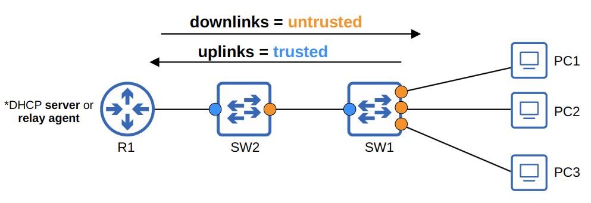
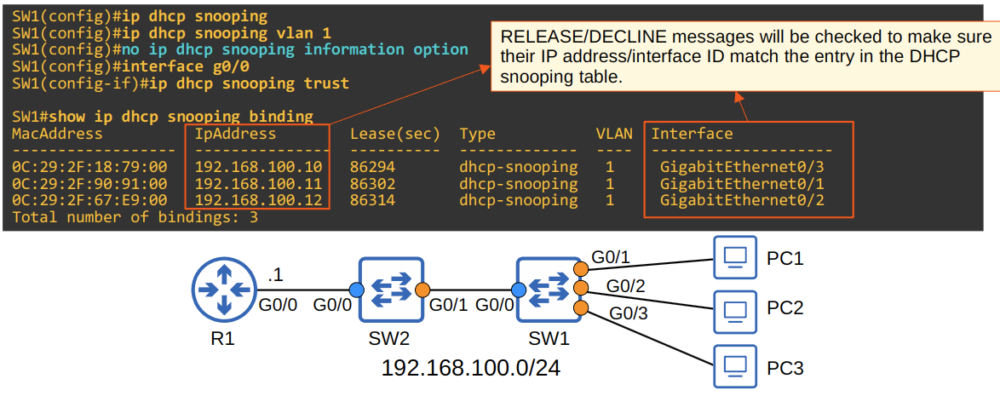

# DHCP Snooping

## Lecture

- DHCP snooping is a security feature of switches to filter DHCP messaged received on **untrusted** ports
- DHCP snooping only filters DHCP messages
  - Non-DHCP messages aren't affected
- All ports are **untrusted** by default
  - Usually, **uplink** ports are configured as **trusted** ports and **downlink** ports remain untrusted

- DHCP snooping helps to prevent DHCP starvation attacks by:
  - Checking the **CHADDR** field in DHCP Discover header against the SRC MAC in the Ethernet header
  - Rate limiting the number of discover messages from a port

### DHCP Messages

- DHCP snooping differentiates between **DHCP Server** and **DHCP Client** messages
  - **DHCP Server** messages
    - OFFER
    - ACK
    - NAK
  - **DHCP Client** messages
    - DISCOVER
    - REQUEST
    - RELEASE
    - DECLINE

### DHCP Snooping Operations

- If a DHCP message is received on a **trusted port**, forward it as normal without inspection
- If a DHCP message is received on an **untrusted port**, inspect it and act as follows:
  - If it is a **DHCP Server** message, discard it
  - If it is a **DHCP Client** message, perform the following checks:
    - DISCOVER or RELEASE MESSAGES: Check the frame's source MAC address and the DHCP message's CHADDR fields match
      - Match = forward
      - Mismatch = discard
    - RELEASE or DECLINE messages: Check if the packet's source IP address and the receiving interface match the entry in the DHCP Snooping Binding Table
      - Match = forward
      - Mismatch = discard
- When a client successfully leases an IP address from a server, create a new entry in the DHCP Snooping Binding Table

### DHCP Option 82

- Option 82 is also known as the 'DHCP relay agent information option' is one of the many DHCP options
- It provides additional information about which DHCP relay agent received the client's message, on which interface, in which vlan, etc.
- DHCP relay agents can add Option 82 to messages they forward to the remote DHCP server
- With DHCP Snooping enabled, by default Cisco switches will add Option 82 to DHCP messages they receive from clients
  - **Even if the switch isn't acting as a DHCP relay agent**
  - By default, Cisco switches will drop DHCP messages with Option 82 that are received on an untrusted port

### DHCP Snooping Rate-Limiting

- DHCP Snooping can limit the rate which DHCP messages are allowed to enter the interface
- If the rate of DHCP messages crosses the configured limit, the interface is err-disabled
- Like with Port Security, the interface can be manually re-enabled, or automatically re-enabled with errdisable recovery
- Rate-limited can be very useful to protect again DHCP exhaustion attacks

## Configuration

- Show the DHCP Snooping Binding table
  - `SW1#show ip dhcp snooping binding`
- Enable DHCP Snooping
  - Enable globally (must be enabled on vlans)
    - `SW1(config)#ip dhcp snooping`
  - Enable on a vlan
    - `SW1(config)#ip dhcp snooping vlan <number>`
  - Turn off Option 82 (if needed)
    - `SW1(config)#no ip dhcp snooping information option`
- Configure an interface as trusted
  - `SW1(config-if)#ip dhcp snooping trust`
- Configure Rate-Limiting
  - `SW1(config-if)#ip dhcp snooping limit rate <packets per second>`
- Enable Errdisable Recovering for Rate-Limiting
  - `SW1(config)#errdisable recovery cause dhcp-rate-limit`
