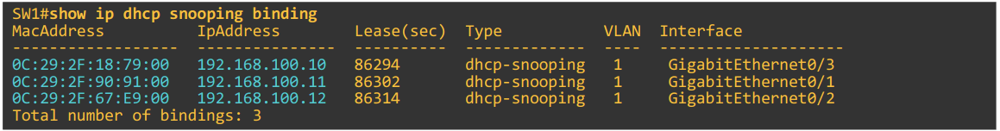

# Dynamic Arp Inspection

## Lecture

- **DAI** (Dynamic Arp Inspection) is a security feature of switches that is used to filter ARP messages received on *untrusted* ports
- DAI only filters ARP messages
  - Non-ARP messages aren't affected
- All ports are **untrusted** by default
  - Typically, all ports connected to other network devices (switches, routers) should be configured as **trusted**, while interfaces connected to end hosts should remain **untrusted**
- DAI helps to prevents against ARP Poisoning (Man-in-the-Middle) attacks

### Dynamic ARP Inspection Operations

- DAI inspects the **sender MAC** and **sender IP** fields of ARP messages on **untrusted** ports and checks that there is a matching entry in the **DHCP snooping binding table**
  - If there is a matching entry, the ARP message is forwarded normally
  - If there isn't a matching entry, the Arp message is discarded

- DAI doesn't inspect messaged received on **trusted** ports
  - These are forwarded as normal
- **ARP ACLs** can be manually configured to map IP addresses and MAC addresses for DAI to check
  - Useful for hosts not using DHCP as they won't have an entry in the DHCP snooping binding table
- DAI can be configured to perform more in-depth checks also
  - These are optional
- Like with DHCP snooping, DAI also supports rate-limiting to prevent attackers from overwhelming the switch with ARP messages
  - DHCP snooping and DAI both require work from the switch's CPU
  - Even if the attacker's messages are blocked, they can over the switch CPU with ARP messages
  - Rate-limiting to errdisable an interface can help to mitigate these sorts of denial and exhaustion attacks
  
### DAI Configuration Notes

- DAI only requires the one command to enable it
  - Unlike DHCP snooping which requires 2
    - Global enable
    - Enable on each VLAN
- DAI rate limiting is enabled on untrusted ports by default and disabled on trusted ports by default
  - 15 packets per second
  - The DAI **burst interval** allows you to configure rate limiting
    - $x$ *packets per* $y$ *seconds*

#### DAI Optional Checks

- `ip arp inspection validate`
- **dst-mac**
  - Enables validation of the destination MAC address in the Ethernet header against the target MAC address in the ARP body for ARP responses
  - The device classifies packets with different MAC addresses as invalid and drops them
- **ip**
  - Enables validation of the ARP body for invalid and unexpected IP addresses
    - Addresses include 0.0.0.0, 255.255.255.255, and all IP multicast addresses
  - The device checks the sender IP addresses in all ARP requests and responses and checks the target IP addresses only in ARP responses
- **src-mac**
  - Enables validation of the source MAC address in the Ethernet header against the sender MAC address in the ARP body for ARP requests and responses
  - The devices classifies packets with different MAC addresses as invalid and drops them

## Configuration

- Show DAI configuration
  - `SW1#show ip arp inspection`
- Show ARP inspection interfaces
  - `SW1#show ip arp inspection interfaces`
- Enable DAI
  - `SW1(config)#ip arp inspection vlan 1`
- Configure a trusted port
  - `SW1(config-if)#ip arp inspection trust`
- Configure DAI rate limiting
  - `SW1(config-if)#ip arp inspection limit rate <packets per second> [burst interval <seconds>]`
    - The burst interval allows for shorter periods of higher traffic
- Configure Errdisable Recovery for DAI
  - `SW1(config)#errdisable recovery cause arp-inspection`
- Configure DAI Optional Checks
  - `SW1(config)#ip arp inspection validate {dst-mac | ip | src-mac}`
    - All desired validation checks must be in a single command
    - One, two, or all three can be specified
    - Order is insignificant
- Create and apply an ARP ACL
  - `SW1(config)#arp access-list <acl-name>`
  - `SW1(config-arp-nacl)#permit ip host <ip> mac host <mac>`
  - `SW1(config)#ip arp inspection filter <acl-name> vlan <id>`
