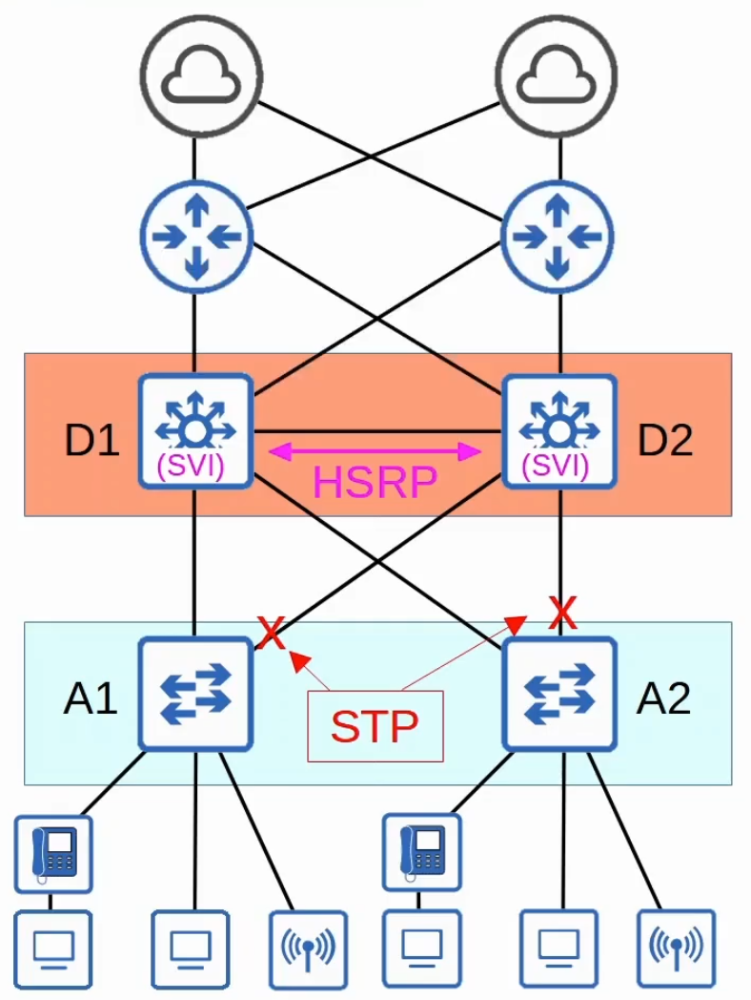
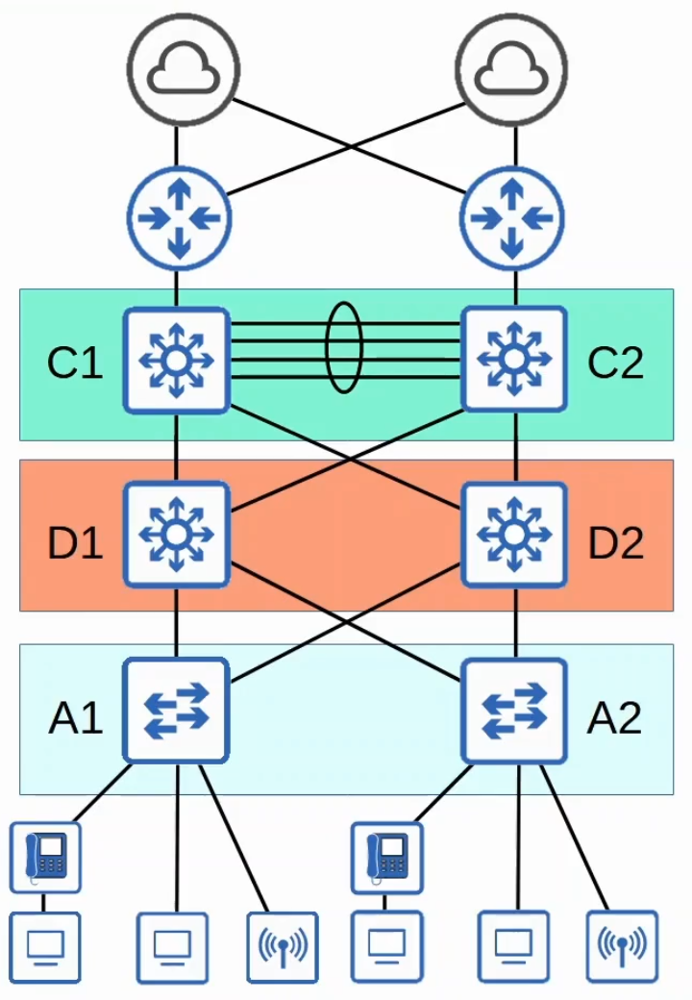
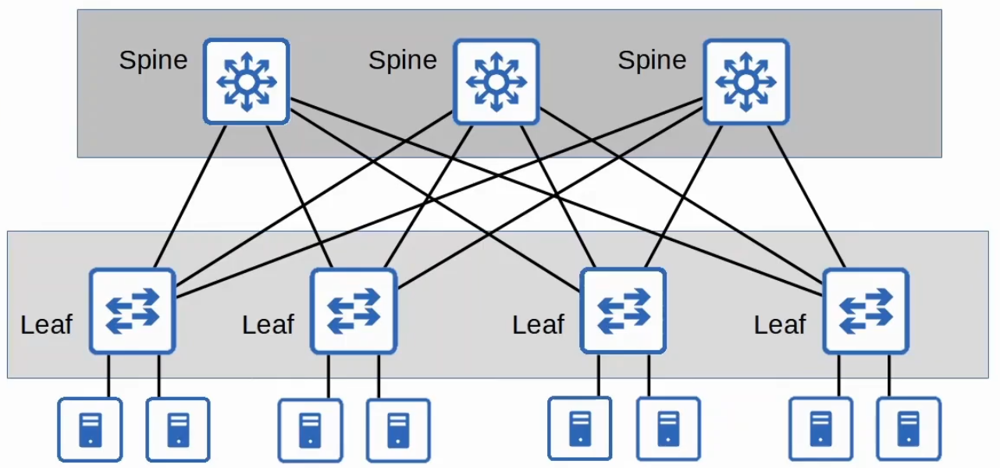

# LAN Architectures

## 2-Tier and 3-Tier LAN Architecture

- **Access Layer**
  - The layer that end hosts connect to
    - PCs, printers, cameras, etc
  - Typically Access Layer Switches have lots of ports for end hosts to connect to
  - QoS marking is typically done here
  - Security services like port security, DAI, etc are typically performed here
  - Switchports might be PoE-enabled for wireless APs, IP phones, etc
- **Distribution Layer** (sometimes call **Aggregation Layer**)
  - Aggregates connections from the Access Layer Switches
  - Typically is the border between Layer 2 and Layer 3
  - Connections between distribution Switches are Layer 3
    - Routing information can be shared via OSPF, for example
  - In a two-tier design
    - Connects to services such as Internet, WAN, etc
    - Can be called 'Collapsed Core' design
      - Or the 'Core-Distribution Layer'
- **Core Layer**
  - Connects Distribution Layers together in large LAN networks
  - The focus is speed
    - 'Fast transport'
  - CPU-intensive operation such as security, QoS marking/classification, etc should be avoided at this layer
  - Connections are all Layer 3
    - **No Spanning-tree**
  - Should maintain connectivity throughout the LAN, even if devices fail

## Spine-Leaf Architecture

- Data centres are dedicated spaces/buildings used to store computer systems such as servers and network devices
- Traditional data centre designs used a three-tier architecture (Access-Distribution-Core)
  - This worked well when most traffic in the data centre was North-South
- With the precedence of virtual servers, applications are other deployed in a distributed manner
  - This increases the amount of East-West traffic in the data center
- The traditional three-tier architecture led to bottlenecks in bandwidth as well as variability in the server-to-server latency depending on the path the traffic takes
  - Spine-Leaf architecture is the solution to this problem

### Spine-Leaf Rules

- Every Leaf switch is connected to every Spine switch
- Every Spine switch is connected to every Leaf switch
- Leaf switches do not connect to other Leaf switches
- Spine switches do not connect to other Spine switches
- End hosts only connect to Leaf switches

- The path taken by traffic is randomly chosen to balance the traffic load among the Spine switches
- Each server is separated by the same number of 'hops' providing consistent latency for East-West traffic

## SOHO Networks

- Small Office/Home Office (SOHO) refers to the office of a small company or the small home office with few devices
- SOHO networks don't have complex needs, so all networking functions are typically provided by a single device
- This one devices serves as:
  - Router
  - Switch
  - Firewall
  - Wireless Access Point
  - Modem
