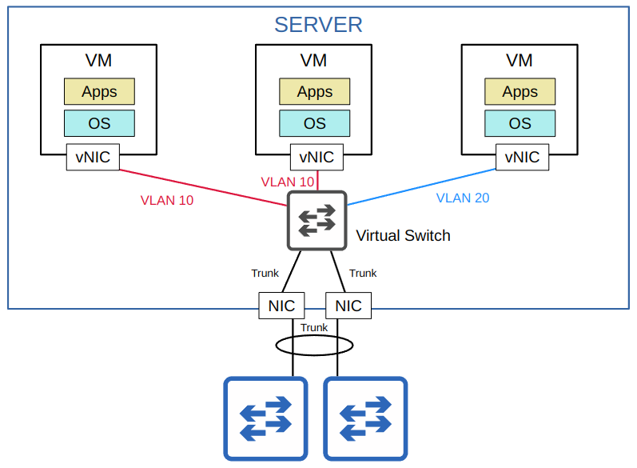
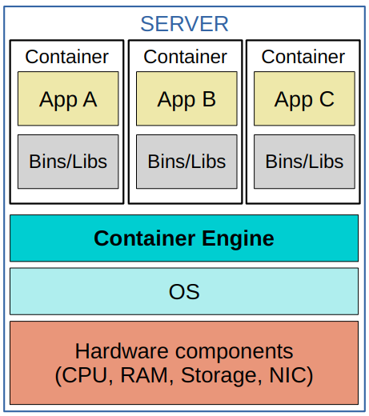

# Virtualisation and Cloud

## Virtualisation (part 1)

- Virtualisation allows us to break the one-to-on relationship of hardware to OS, allowing multiple OSs to run on a single physical server
- Each instance is called a VM (Virtual Machine)
- A **hypervisor** is used to manage and allocate the hardware resources
  - Also called *VMM* (Virtual Machine Monitor)
  - A **Type 1** hypervisor runs directly on top of the hardware
    - Also called *bare-metal* or *native hypervisor*
    - Most common in data centre environments
  - A **Type 2** hypervisor runs a a program on top of the an operating system
    - The OS on the hardware is called the **Host OS**, the OS running in the VM is called a **Guest OS**
    - Also called *hosted hypervisor*
    - Most common on personal-use devices

### Why Virtualisation?

- **Partitioning**
  - Run multiple operating systems on one physical machine
  - Divide system resources between virtual machines
- **Isolation**
  - Provide fault and security isolation at the hardware level
  - Preserve performance with advanced resource controls
- **Encapsulation**
  - Save the entire state of a virtual machine to files
  - Move and copy virtual machines as easily as moving and copying files
- **Hardware Independence**
  - Provision or migrate any virtual machine to any physical server

### Connecting VMs to the Network

- VMs are connected to each other and the external network via a virtual switch running on the hypervisor
- Just like a regular physical switch, the vSwitch's interfaces can operate as access or trunk ports and use VLANs to separate the VMs at Layer 2
- Interfaces on the vSwitch connect to the physical NIC of the server to communicate with the external network.

## Cloud Computing (part 1)

- **On-premise**
  - All servers, network devices, and other infrastructure are located on company property
  - All equipment is purchased and owned by the company using it
  - The company is responsible for the necessary space, power, and cooling
- **Colocation**
  - Data centres that rent out space for customers to put their infrastructure
  - The data centre provides the space, electricity, and cooling
  - The servers, network devices, etc are still the responsibility of the end customer, although they are not located on the customer's premises

### Cloud Services

Cloud computing is a model for enabling ubiquitous, convenient, on-demand network access to a shared pool of configurable computing resources (e.g., networks, servers, storage, applications, and services) that can be rapidly provisioned and released with minimal management effort or service provider interaction. This cloud model is composed of five essential characteristics, three service models, and four deployment models.

#### The Five Essential Characteristics of Cloud

1. **On-demand self-service**
    - *A consumer can unilaterally provision computing capabilities, such as server time and network storage, as needed automatically without requiring human interaction with each service provider.*
    - The customer is able to use the service (or stop using the service) freely (via a web portal) without direct communication to the service provider

2. **Broad network access**
    - *Capabilities are available over the network and accessed through standard mechanisms that promote use by heterogeneous thin or thick client platforms (e.g., mobile phones, tablets, laptops, and workstations).*
    - The service is available through standard network connections (ie. the Internet or private WAN connections), and can be accessed through many kinds of devices

3. **Resource pooling**
    - *The provider’s computing resources are pooled to serve multiple consumers using a multi-tenant model, with different physical and virtual resources dynamically assigned and reassigned according to consumer demand. There is a sense of location independence in that the customer generally has no control or knowledge over the exact location of the provided resources but may be able to specify location at a higher level of abstraction (e.g., country, state, or datacenter). Examples of resources include storage, processing, memory, and network bandwidth.*
    - A pool of resources is provided by the service provider, and when a customer requests a service (for example creates a new VM), the resources to fulfill that request are allocated from the shared pool

4. **Rapid elasticity**
    - *Capabilities can be elastically provisioned and released, in some cases automatically, to scale rapidly outward and inward commensurate with demand. To the consumer, the capabilities available for provisioning often appear to be unlimited and can be appropriated in any quantity at any time.*
    - Customers can quickly expand their services they use in the cloud (for example, add new VMs, expand storage, etc) from a pool of resources that appears to be infinite. Likewise, they can quickly reduce their services when not needed

5. **Measured service**
    - *Cloud systems automatically control and optimize resource use by leveraging a metering capability at some level of abstraction appropriate to the type of service (e.g., storage, processing, bandwidth, and active user accounts). Resource usage can be monitored, controlled, and reported, providing transparency for both the provider and consumer of the utilized service.*
    - The cloud service provider measures the customer's usage of cloud resources, and the customer can measure their own use as well. Customers are charged based on usage (for example, X dollars per gigabyte of storage per day)

#### The Three Service Models of Cloud

1. **Software as a Service (SaaS)**
    - *The capability provided to the consumer is to use the provider’s applications running on a cloud infrastructure. The applications are accessible from various client devices through either a thin client interface, such as a web browser (e.g., web-based email), or a program interface. The consumer does not manage or control the underlying cloud infrastructure including network, servers, operating systems, storage, or even individual application capabilities, with the possible exception of limited user-specific application configuration settings.*

2. **Platform as a Service (PaaS)**
    - *The capability provided to the consumer is to deploy onto the cloud infrastructure consumer-created or acquired applications created using programming languages, the underlying cloud infrastructure including network, servers, operating systems, or storage, but has control over the deployed applications and possibly configuration settings for the application-hosting environment.*

3. **Infrastructure as a Service (IaaS)**
    - *The capability provided to the consumer is to provision processing, storage, networks, and other fundamental computing resources where the consumer is able to deploy and run arbitrary software, which can include operating systems and applications. The consumer does not manage or control the underlying cloud infrastructure but has control over operating systems, storage, and deployed applications; and possibly limited control of select networking components (e.g., host firewalls).*

#### The Four Deployment Models of Cloud

1. **Private Cloud**
    - *The cloud infrastructure is provisioned for exclusive use by a single organization comprising multiple consumers (e.g., business units). It may be owned, managed, and operated by the organization, a third party, or some combination of them, and it may exist on or off premises.*
    - Private clouds are generally only used by large enterprises
    - Although the cloud is private, it may be owned by a third party
      - AWS provides private cloud services for the American DoD
    - Private clouds may be on or off premises
      - Many people assume that 'cloud' and 'on-prem' are two different things, but that is not always the case
    - The same kinds of services offered are the same as in public clouds (SaaS, PaaS, IaaS), but the infrastructure is reserved for a single organisation

2. **Community Cloud**
    - *The cloud infrastructure is provisioned for exclusive use by a specific community of consumers from organizations that have shared concerns (e.g., mission, security requirements, policy, and compliance considerations). It may be owned, managed, and operated by one or more of the organizations in the community, a third party, or some combination of them, and it may exist on or off premises.*
    - This is the least common cloud deployment
    - Similar to a private cloud, but the infrastructure is reserved for use by only a specific group of organisations
  
3. **Public Cloud**
    - *The cloud infrastructure is provisioned for open use by the general public. It may be owned, managed, and operated by a business, academic, or government organization, or some combination of them. It exists on the premises of the cloud provider.*
    - Most common cloud deployment

4. **Hybrid Cloud**
    - *The cloud infrastructure is a composition of two or more distinct cloud infrastructures (private, community, or public) that remain unique entities, but are bound together by standardized or proprietary technology that enables data and application portability (e.g., cloud bursting for load balancing between clouds)*
    - This is basically any combination of the previous three deployment types.

#### Benefits of Cloud Computing

- **Cost**
  - CapEx (Capital Expenses) of buying hardware and software, setting up data centres, etc. are reduced or eliminated
- **Global Scale**
  - Cloud services can scale globally at a rapid pace
  - Services can be set up and offered to customers from a geographic location close to them
- **Speed/Agility**
  - Services are provided on demand, and vast amounts of resources can be provisioned within minutes
- **Productivity**
  - Cloud Services remove the need for many time-consuming tasks such as procuring physical servers, racking them, cabling them, installing and updating operating systems, etc.
- **Reliability**
  - Backups in the cloud are very easy to perform. Data can be mirrored at multiple sites in different geographic locations to support disaster recovery

## Containers (part 2)

- **Containers** are software packages that contain an app and all dependencies (Bins/Libs) for the contained app to run
  - Multiple apps can be run in a single container, but this is not how containers are usually used
- Containers run on a **Container Engine** (ie. Docker Engine)
  - The container engine is run on a host OS (usually linux)
- Containers are lightweight (small in size) and include only the dependencies required to run the specific app
- A **Container Orchestrator** is a software platform for automating the deployment, management, scaling etc. of containers
  - **Kubernetes** is the most popular container orchestrator
  - **Docker Swarm** is Docker's container orchestration tool
  - In small numbers manual operation is possible, but large-scale systems (ie. with *Microservices*) can require thousands of containers
    - **Microservice Architecture** is an approach to software architecture that divides a larger solution into smaller parts (microservices)
      - Those microservices all run in containers that can be orchestrated by Kubernetes (or another platform)

### VMs vs Containers

| **VMs**                                                                           | **Containers**                                                                                                      |
|-----------------------------------------------------------------------------------|---------------------------------------------------------------------------------------------------------------------|
| Can take minutes to boot up as each VM runs its own OS                         | Can boot up in milliseconds                                                                                         |
| Takes up more disk space (gigabytes)                                           | Takes up very little disk space (megabytes)                                                                      |
| Uses more CPU/RAM resources (each VM must run its own OS)                      | Uses much fewer CPU/RAM resources (shared OS)                                                                    |
| Are portable and can move between physical systems running the same hypervisor | Are more portable; smaller, faster to boot and Docker containers can be run on nearly any container service   |
| Are more isolated because each VM runs its own OS                              | Less isolated because they all run on the same OS; if the OS crashes, all containers running on it are effected. |

## Virtual Routing and Forwarding (part 3)
