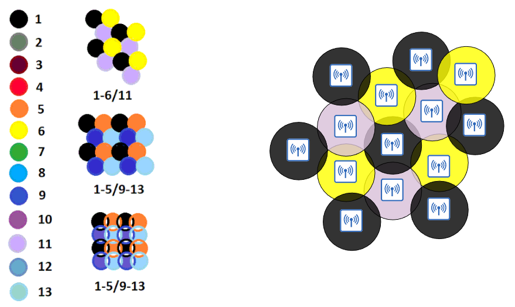

# Wireless Fundamentals

- The standard for wireless LANs are defined in IEEE 802.11
- The term **Wi-Fi** is a trademark of the **Wi-Fi Alliance**, not directly connected to the IEEE
  - The Wi-Fi Alliance tests and certifies equipment for 802.11 standards compliance interoperability with other devices

## Wireless Networks

Wireless networks have some issues that we need to deal with

1. All devices within range receive all frames
   - Like devices connect to an Ethernet Hub
   - Privacy of data within the LAN is a greater concern
   - **CSMA/CA** (Carrier Sense Multiple Access with Collision Avoidance) is used to facilitate half-duplex communications
     - When using **CSMA/CA**, a device will wait for other devices to stop transmitting before it transmits data itself
2. Wireless communications are regulated by various international and national bodies
3. Wireless signal coverage area must be considered
   - Signal range
   - Signal **absorption**
     - When a wireless signal passes through a material and is converted into heat, weakening the original signal
   - Signal **reflection**
     - When the signal bounces of a material
   - Signal **refraction**
     - When a wave enters a medium is "bends" where the signal travels at a different speed
   - Signal **diffraction**
     - When a wave encounters an obstacle and travels around it
       - Can result in 'blind spots' behind the obstacle
   - Signal **scattering**
     - When a material causes a signal to scatter in all directions
4. Other devices using the same channels can cause interference

### Radio Frequency

- Wi-Fi uses two main *bands*
  - **2.4 GHz**
    - Provides a longer range in an open space, better penetration of obstacles
  - **5 GHz**
    - Higher speeds and less devices in this band
  - **Wi-Fi 6** (802.11ax) has expanded the spectrum range to include a band in the **6 GHz** range
- Each band is divided up into multiple 'channels'
  - Devices are configured to transmit and receive traffic on one or more of these channels
  - The 2.4 GHz band is divided into several channels, each with a 22 MHz bandwidth
- In a small wireless LAN with only a single AP, you can use any channel
- In larger WLANs with multiple APs, adjacent APs should avoid using overlapping channels to reduce interference
  - In 2.4 GHz it is recommended to use channels **1, 6, 11**
  - The 5 GHz band consists of non-overlapping channels, so it is much easier to avoid interference between adjacent APs
- Using the preferred channels **1, 6, 11**, you can place APs in a 'honeycomb' pattern

| **Standard** | **Frequencies** | **Max Data Rate (theoretical)** | **Alternate Name** |
|:------------:|:---------------:|:----------------------------------:|:------------------:|
| 802.11       | 2.4 GHz         | 2 Mbps                             |                    |
| 802.11b      | 2.4 GHz         | 11 Mbps                            |                    |
| 802.11a      | 5 GHz           | 54 Mbps                            |                    |
| 802.11g      | 2.4 GHz         | 54 Mbps                            |                    |
| 802.11n      | 2.4/5 GHz       | 600 Mbps                           | 'Wi-Fi 4'          |
| 802.11ac     | 5 GHz           | 6.93 Gbps                          | 'Wi-Fi 5'          |
| 802.11ax     | 2.4/5/6 GHz     | 4 $\times$ 802.11ac                | 'Wi-Fi 6'          |

### Service Sets

- 802.11 defines different kinds of **service sets** which are groups of wireless network devices
- There are three main types:
  - Independent
  - Infrastructure
  - Mesh
- All devices in a service set share the same **SSID (service set identifier)**
  - The SSID is a human-readable name which identifies the service set
  - The SSID does **not** have to be unique

---

- **Independent Basic Service Set** (IBSS) is a wireless network in which two or more wireless devices connect directly without using an AP
  - Also called an **ad hoc** network
  - Can be used for file transfer
  - Not scalable beyond a few devices

- **Basic Service Set** (BSS) is a kind of Infrastructure Service Set in which clients connect to each other via an AP, but not directly to each other
  - A **Basic Service Set ID** (BSSID) is used to uniquely identify the AP
    - Other APs can use the same SSID but not the same BSSID
    - The BSSID is the MAC address of the AP's radio
- Wireless devices request to *associate* with the BSS
  - Wireless devices that have associated with the BSS are called 'clients' or 'stations
- The area around an AP where its signal is usable is called a **BSA (Basic Service Area)**

- To create larger wireless LANs beyond the range of a single AP, we use an **Extended Service Sets** (ESS)
- APs with their own BSSs are connected by a wired network
  - Each BSS uses the same SSID
  - Each BSS has a unique BSSID
  - Each BSS uses a different channel to avoid interference
- Clients can pass between APs without having to reconnect
  - Provides a seamless Wi-Fi experience when moving between Aps
  - This is called **roaming**
- The BSAs should overlap about 10-15%

- An **MBSS (Mesh Basic service Set)** can be used in situations where it's difficult to run an Ether connection to every AP
- Mesh Aps use two radios
  - One to provide a BSS to wireless clients
  - One to form a 'backhaul network' which is used to bridge traffic from AP to AP
- At least one AP is connected to the wired network, and is called the **RAP (Root Access Point)**
- The other APs are called **MAP**s **(Mesh Access Points)**
- A protocol is used to determine the best path through the mesh
  - Similar to how dynamic routing protocols are used to determine the best path to a destination

- Most wireless networks aren't standalone networks
  - They are a way for wireless clients to connect to the wired network infrastructure
- In 802.11, the upstream wired network is called the **DS (Distributed System)**
- Each wireless BSS or ESS is mapped to a VLAN in the wired network
- It is possible for an AP to provide multiple wireless LANs, each with a unique SSID
  - Each WLAN is mapped to a separate VLAN and connected to the wired network via a trunk
  - Each WLAN uses a unique BSSID, usually incrementing the last digit by the BSSID by one

#### Additional Modes

- APs can operate in additional modes
- An AP in **repeater** mode can be used to extend the range of a BSS
  - The repeater will simply retransmit any signal it receives from the AP
    - A repeater with a single radio must operate on the same channel as the AP
      - This can drastically reduce the overall throughput on the channel (by approx. 50%)
    - A repeater with two radios can receive on one channel and retransmit on another channel
- A **workgroup bridge (WGB)** operates as a wireless client of another AP
  - Can be used to connect wired devices to the wireless network
  - There are two kinds of WGBs
    - **Universal WGB (uWGB)** is an 802.11 standard that allows one device to be bridged bridged to the wireless network
    - **WGB** is a Cisco-proprietary version of the 802.11 standard that allows multiple wired clients to be bridged to the wireless network
- An **Outdoor Bridge** can be used to connect networks over a long distance without a physical cable connecting them
  - The APs will use specialised antennas that focus most of the signal power in one direction
  - The connection can be point-to-point or point-to-multipoint
    - Multiple sites connect to one central site
