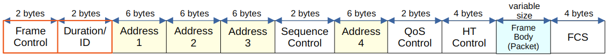
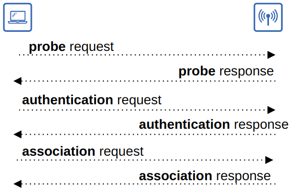
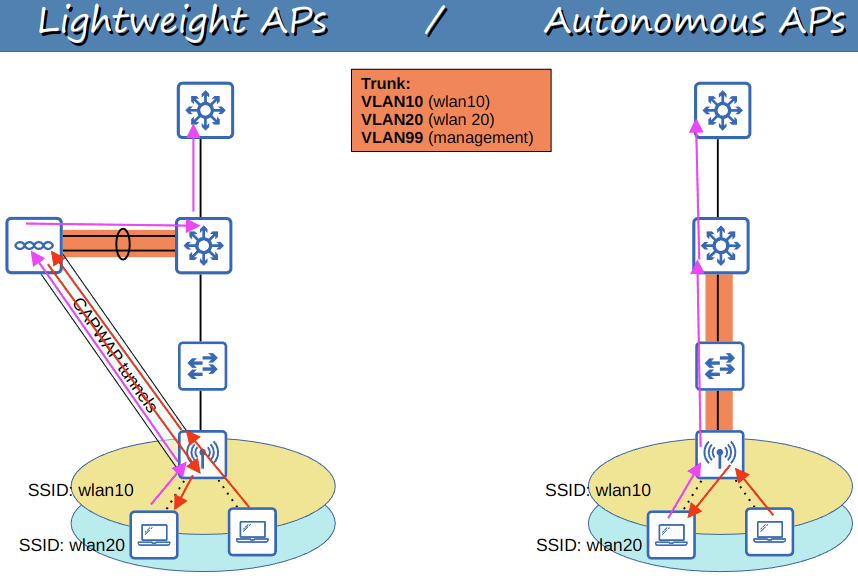
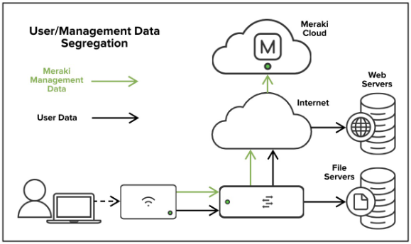

# Wireless Architectures

## 802.11 Frame Format

- **Frame Control** (2 bytes)
  - Provides information such as the message type and subtype
- **Duration/ID** (2 bytes)
  - Depending on the message type, this field can indicate:
    - The time (in microseconds) the channel will be dedicated for transmission of the frame
    - The identifier for the association (connection)
- **Addresses** (6 bytes)
  - Up to four addresses can be present in the 802.11 frame. Which are present and their order depends on the message type
    - Destination Address (DA): Final recipient of the frame
    - Source Address (SA): Original sender of the frame
    - Receiver Address (RA): Immediate recipient of the frame
    - Transmitter Address (TA): Immediate sender of the frame
- **Sequence Control** (2 bytes)
  - Used to reassemble fragments and eliminate duplicate frames
- **QoS Control** (2 bytes)
  - Used in QoS to prioritise certain traffic
- **HT (Hight Throughput) Control** (4 bytes)
  - Added in 801.11n to enable *High Throughput* operations
    - 802.11n is known as '*High Throughput* (HT)' Wi-Fi
    - 802.11ac is known as '*Very High Throughput*' (VHT) Wi-Fi
- **FCS (Frame Check Sequence)** (4 bytes)
  - Same as in an Ethernet frame, used to check for errors

### 802.11 Association Process

- Access Points bridge traffic between wireless stations and other devices
- For a station to send traffic through the AP, it must be associated with the AP
- There are three 802.11 connection states:
  - Not authenticated, not associated
  - Authenticated, not associated
  - Authenticated and associated
- The station must be both authenticated and associated with the AP to send traffic through it
- There are two ways a station can scan for a BSS
  - **Active Scanning**
    - The station sends probe requests and listens for a probe response from an AP
  - **Passive Scanning**
    - The station listens for **beacon** messages from an AP
    - Beacon messages are sent periodically by APs to advertise the BSS

### 802.11 Message Types

There are three 802.11 message types:

1. **Management**
   - Used to manage the BSS
     - Beacon
     - Probe request, probe response
     - Authentication
     - Association request, association response
2. **Control**
   - Used to control access to the medium (radio frequency)
   - Assists with delivery of management and data frames
     - RTS (Request to Send)
     - CTS (Clear to Send)
     - ACK
3. **Data**
   - Used to send data packets

## Access Point Deployment

### Autonomous APs

- Autonomous APs are self-contained systems that don't rely on a WLC (Wireless LAN controller)
- Autonomous APs are configured individually
  - Can be configured by:
    - Console cable (CLI)
    - Telnet/SSH (CLI)
    - HTTP/S web connection (GUI)
  - An IP address for remote management should be configured
  - The RF parameters must be manually configured (transmit power, channel, etc)
  - Security policies are handles individually by each AP
  - QoS rules etc. are configured individually on each AP
- There is no central monitoring or management of APs
- Autonomous APs connect to the wired network with a trunk link
- Data traffic from wireless clients has a very direct path to the wired network
  - Or to other wireless clients associated with the same AP
- Each VLAN has to stretch across the entire network
  - This is considered bad practice
    - Large broadcast domains
    - Spanning tree will disable links
    - Adding/deleting VLANs is very labour-intensive
- Autonomous APs can function in previously mentioned modes:
  - Repeater
  - Outdoor Bridge
  - Workgroup Bridge

### Lightweight APs

- The functions of an AP can be split between the AP and a **Wireless LAN Controller (WLC)**
- **Lightweight APs** handle 'real-time' operations
  - Transmitting/receiving RF traffic
  - Encryption/decryption of traffic
  - Sending beacons and probes, etc
- Other functions are carried out by a WLC
  - RF management
  - Security/QoS management
  - Client authentication
  - Client association/roaming management, etc
- This is called **split-MAC architecture**
- The WLC is used to centrally configure the *lightweight APs*
- The WLC can be located in the same subnet/VLAN as the *lightweight APs* it manages, or in a different subnet/VLAN
- The WLC and *lightweight APs* authenticate with each other using digital certificates installed on each device (X.509 standard certificates)
  - Ensures only authorised APs can join the network
- Key benefits to the split-MAC architecture are:
  - **Scalability**
    - With a WLC it's much simpler to build and support a network with thousands of APs
  - **Dynamic channel assignment**
    - The WLC can automatically select with channel each AP should use
  - **Transmit power optimisations**
    - The WLC can automatically set the appropriate transmit power for each AP
  - **Self-healing wireless coverage**
    - When an AP stops functioning, the WLC can increase the transmit power of nearby APs to avoid coverage holes
  - **Client load balancing**
    - If a client is in range of two APs, the WLC can associate the client with the least-used AP to balance the load among APs
  - **Security and QoS management**
    - Central management of security and QoS policies ensures consistency across the network

#### Control And Provisioning of Wireless Access Points

- The WLC and lightweight APs use a protocol called CAPWAP (Control And Provisioning of Wireless Access Points) to communicate
  - Based on an older protocol called LWAPP (Lightweight Access Point Protocol)
- Two tunnels are created between each AP and the WLC
  - **Control Tunnel (UDP port 5246)**
    - This tunnel is used to configure the APs and control/manage the operations
    - All traffic in this tunnel is encrypted by default
  - **Data Tunnel (UDP port 5247)**
    - All traffic from wireless clients is sent through this tunnel to the WLC
      - **It does not go directly to the wired network** (by default)
    - Traffic in this tunnel is not encrypted by default
      - Can configure DTLS (Datagram Transport Layer Security)
- Because all traffic from wireless clients is tunneled to the WLC with CAPWAP, APs connect to switch access ports, not trunk ports
  - There is no longer VLANs all over the network

#### Lightweight AP Modes

- **Local**
  - This is the default mode where the AP offers a BSS (or multiple BSSs) for clients to associate with
- **FlexConnect**
  - Like a lightweight AP in Local mode, it offers one or more BSSs for clients to associate with
  - However, FlexConnect allows the AP to locally switch traffic between the wired and wireless networks if the tunnels to the WLC go down
- **Sniffer**
  - The AP does not offer a BSS for clients
  - It is dedicated to capturing 802.11 frames and sending them to a device running software
    - Such as Wireshark
- **Monitor**
  - The AP does not offer a BSS for clients
  - It is dedicated to receiving 802.11 frames to detect rogue devices
  - If a client is found to be a rogue device, it can send de-authentication messages to disassociate them from their AP
- **Rogue Detector**
  - The AP does not even use its radio
  - It listens to traffic on the wired network only, but it receives a list of suspected rogue clients and AP MAC addresses from the WLC
  - By listening to ARP messages on the wired network and correlating it with the information it receives from the WLC, it can detect rogue devices
- **SE-Connect (Spectrum Expert Connect)**
  - The AP does not off a BSS for clients.
  - It is dedicated to RF spectrum analysis on all channels
  - It can send information to software on a PC to collect and analyst the data
    - Cisco Spectrum Expert is an example of said software
- **Bridge/Mesh**
  - Like the autonomous AP's *Outdoor Bridge*
  - The lightweight AP can be a dedicated bridge between sites
  - A mesh can be made between the access points
- **Flex plus Bridge**
  - Adds FlexConnect functionality to the Bridge/Mesh mode
  - Allows wireless access points to locally forward traffic, even if connectivity to the WLC is lost

### Cloud-Based APs

- **Cloud-Based AP** architecture is in between autonomous AP and split-MAC architecture
  - Autonomous APs that are centrally managed in the cloud
- A web-based dashboard is used to configure APs, monitor the network, generate performance reports, etc.
  - Cisco Meraki is an example of this software
- However, data traffic is not sent to the cloud
  - Data traffic is switched/routed as needed
  - Management traffic is switched/routed to the cloud
    - There is no CAPWAP tunnel or anything similar

## WLC Deployments

In a split-MAC architecture, there are four main WLC deployment models

- **Unified**
  - The WLC is a hardware appliance in a central location of the network
  - Can support up to approx 6000 APs
- **Cloud-based**
  - The WLC is a VM running on a server
    - Typically in a private cloud
  - This is not the the same as the "Cloud-Based AP"
    - That one (Meraki) doesn't use CAPWAP, this one does
  - Can support approx. 3000 APs
- **Embedded**
  - The WLC is embedded within a switch
  - Can support approx 200 APs
- **Mobility Express**
  - The WLC is integrated with an AP
  - Can support approx 100 APs
