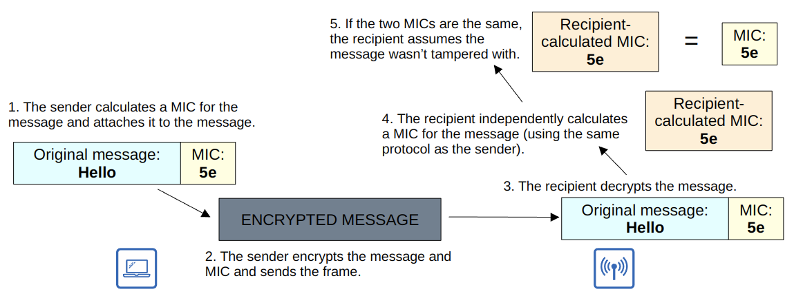

# Wireless Security

## Network Security

- Any device within range of the signals can receive the traffic
- It is important to encrypt wireless traffic between the wireless clients and the AP
- There are three main concepts:
  - Authentication
  - Encryption
  - Integrity

### Authentication

- All clients must be authenticated before they can associate with an AP
- In a corporate setting, only trusted users/devices should be given access to the corporate network
  - A separate SSID without access to the corporate network can be provided for guests
- Ideally clients should also authenticate the AP to avoid associating with a malicious AP
- There are multiple ways to authenticate
  - Password
  - Username:Password
  - Certificates

### Encryption

- Traffic between clients and APs should be encrypted so that it can't be read by anyone except the AP and the client
- All devices on the WLAN will use the same protocol
  - Each client will use a unique encryption/decryption key so other traffic cannot read its traffic
- A 'group key' is used by the AP to encrypt traffic that is wants to send to all of its clients
  - All of the clients associated with teh AP keep that key

### Integrity

- A Message Integrity Check (MIC) is added to messages to help protect their integrity
  - The MIC independently calculated by the recipient and compared.
  - If they are different, the message is dropped

## Authentication Methods

- Open Authentication
- WEP (Wired Equivalent Privacy)
- EAP (Extensible Authentication Protocol)
- LEAP (Lightweight Extensible Authentication Protocol)
- EAP-FAST (Extensible Authentication Protocol - Flexible Authentication via Secure Tunneling)
- PEAP (Protected Extensible Authentication Protocol)
- EAP-TLS (Extensible Authentication Protocol - Transport Layer Security)

### Open Authentication

- The client sends an authentication request, and the AP accepts it. No questions asked!
- Clearly not secure
- After the client is authenticated and associated with the AP, it is possible to require the user to authenticate via other means before access is granted to the network
  - Think coffee-shop free WiFi or shopping centre free WiFi

### Wired Equivalent Privacy

- WEP is used to provide both authentication and encryption of wireless traffic
- WEP uses the **RC4 algorithm** for encryption
- Shared-key protocol
  - Requires the sender and receiver to have the same key
- WEP keys can be 40 bits or 104 bits in length
  - Combined with a 24-bit Initialisation Vector to bring the total length to 64 bits or 128 bits
- WEP is **NOT SECURE** and can easily be cracked
- WEP can be used for authentication by:
  1. AP sends a 'challenge phrase'
  2. Client encrypts the 'challenge phrase' using WEP key and sends it back
  3. AP compares client's encrypted challenge phrase with AP's challenge phrase

### Extensible Authentication Protocol

- **EAP** is an authentication framework
  - Defines a standard set of authentication function that are used by the various *EAP Methods*
  - EAP is integrated with 802.1x, which provides *port-based network access control*

- **802.1x** is used to limit network access for clients connected to a LAN or WLAN until they authenticate
  - **Supplicant**: The device that wants to connect to the network
    - The client laptop, phone, watch, etc
  - **Authenticator**: The device that provides access to the network
    - The WAP or WLC
  - **Authentication Server (AS)**: The device that receives client credentials and permits/denies access
    - The RADIUS or TACACS+ server

### Lightweight EAP

- **LEAP** was developed by Cisco as an improvement over WEP
- Clients must provide a username and password to authenticate
- In addition, *mutual authentication* is provided by both the client and the AS
  - They send a challenge phrase to each other
- *Dynamic* WEP keys are used, meaning that the WEP keys are changed frequently
- Like WEP, LEAP is **CONSIDERED VULNERABLE** and should not be used anymore

### EAP-FAST

- **EAP Flexible Authentication via Secure Tunneling** was developed by Cisco
- Consists of three phases:
  1. A **PAC** (Protected Access Credential) is generated and passed from the AS to the client
  2. A secure TLS tunnel is established between the client and AS
  3. Inside of the secure (encrypted) TLS tunnel, the client and AS communicate further to authenticate and authorise the client

### PEAP

- **Protected EAP** involves establishing a secure TLS tunnel between the client and AS
- Like EAP-FAST however, instead of a PAC the AS has a digital certificate
  - The client uses this digital certificate to authenticate the AS
  - The certificate is also used to establish a TLS tunnel
- Because only the AS provide a certificate for authentication, the client must be authenticated within the secure tunnel
  - Using a protocol like MS-CHAP (Microsoft Challenge-Handshake Authentication Protocol)

### EAP-TLS

- **EAP-TLS** requires every single client to have a certificate, as well as the AS
- EAP-TLS is the most secure wireless authentication method
  - But also the most difficult to implement since every client needs a certificate
- Since the client and AS authenticate each other with digital certificates, there is no need to authenticate the client within the TLS tunnel
  - The TLS tunnel is still used to exchange encryption key information

## Encryption and Integrity Methods

- TKIP (Temporal Key Integrity Protocol)
- CCMP (Counter/CBC-MAC Protocol)
- GCMP (Galois/Counter Mode Protocol)

### Temporal Key Integrity Protocol

- **TKIP** is a temporary solution after WEP was found to be vulnerable
  - Until a new standard created and new hardware built
  - Modification on WEP to use at-the-time current hardware
- A **MIC** (Message Integrity Check) is added to protect the integrity of messages
  - Also included the sender MAC address to identify the frame's sender
- A **Key mixing algorithm** is used to create a unique WEP key for every frame
- The **Initialisation Vector** is doubled in length
  - From 24 bits to 48 bits, making brute-force attacks much more difficult
- A **timestamp** is added to the MIC to prevent replay attacks
- A **TKIP sequence number** is used to keep track of frames sent from each source MAC address
  - Also helps to protect against replay attacks
- Used in WPA version 1

### Counter/CBC-MAC Protocol

- **CCMP** was developed after TKIP and is much more secure
- Used in WPA2
- Consists of two different algorithms to provide encryption and MIC:
  1. **AES (Advanced Encryption Standard) counter mode** encryption
     - There are multiple modes of operation for AES
     - CCMP uses 'counter mode' which has been optimised for speed
  2. **CBC-MAC (Cipher Block Chaining Message Authentication Code)**
     - Used as a MIC to ensure the integrity of messages

### Galois/Counter Mode Protocol

- **GCMP** is both more secure and more efficient than CCMP
  - This allows a higher data throughput than CCMP
- Used in WPA3
- Consists of two different algorithms to provide encryption and MIC:
  1. **AES Counter Mode** encryption
  2. **GMAC (Galois Message Authentication Code)**
     - Used as a MIC

## Wi-Fi Protected Access (WPA)

- The Wi-Fi Alliance has developed three WPA certifications for wireless devices
  - WPA
  - WPA2
  - WPA3
- To be WPA-certified, equipment must be tested in authorised testing labs
- Each certification supports two authentication modes:
  - **Personal Mode**
    - When you connect to a home Wi-Fi network, enter the password and are authenticated, that is **personal** mode
    - Common in small networks
    - A pre-shared key (PSK) is used for authentication.
      - The PSK itself is not sent over the air
      - A four-way handshake is used to generate encryption keys
  - **Enterprise Mode**
    - 802.1x is used with an authentication server (RADIUS or TACACS+)
    - No specific EAP method is specified, so all are supported

### WPA Certification

- **WPA**
  - Developed after WEP was proven to be vulnerable
  - Includes the following protocols:
    - TKIP to provide encryption and MIC
    - 802.1x authentication
- **WPA2**
  - Released in 2004
  - Includes the following protocols
    - CCMP to provide encryption and MIC
    - 802.1x authentication
- **WPA3**
  - Released in 2018
  - Includes the following protocols:
    - GCMP to provide encryption and MIC
    - 802.1x authentication
  - Also includes the following additional security features
    - **PMF** (Protected Management Frames)
      - Protects 802.11 management frames from eavesdropping and forging
    - **SAE** (Simultaneous Authentication of Equals)
      - Protects the four-way handshake when used personal mode authentication
    - **Forward Secrecy**
      - Prevents data from being decrypted after it has been transmitted over the air
      - An attacker can't capture wireless frames and decrypt them later
