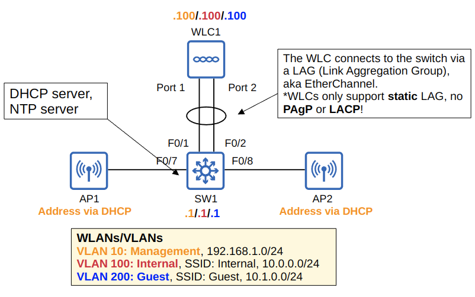
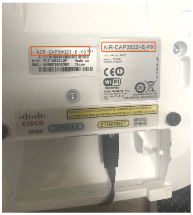
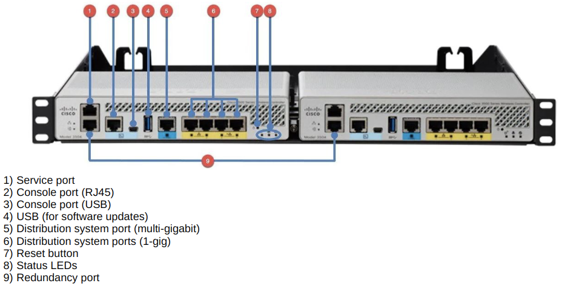

# Wireless Configuration

## Switch Configuration

- Three vlans
  - Name and numbered as per the picture above
- Using split-MAC architecture (Lightweight APs)
  - Interfaces from the switch to the APs set as `access` with `portfast`
  - Interfaces from the switch to the WLC aggregated to a static LAG (Link Aggregate Group, etherchannel)
    - Must be static, no PAgP or LACP
    - The LAG is set as `trunk` allowing the three VLANs
- Additional `access` and `portfast` port for laptop to configure the APs in the WLC
  - The web-based GUI can only be accessed from the network, not the console
- The SVIs for each VLAN are given and IP address
- Three DHCP pools are created, one for each VLAN
  - The SVI for each VLAN is set as the default-router
  - For VLAN10, the Management VLAN, Option 43 is activated
    - `SW1(dhcp-config)#option 43 ip 192.168.1.100`
    - Option 43 can be used to tell the APs the IP address of their WLC
      - Technically not necessary in this case, since the APs are WLC are in the same subnet.
- The switch is set as an NTP server
  - `ntp master`

## WLC Initial Setup

- Connect to the console port of the WLC
- Walk through the installation wizard
  - Ensure the settings match what is needed by the L3 Switch
- Ensure the "Country Code" matches the regulatory domain of the device
  - The **E** in the below picture

The WLC will reboot once the initial installation wizard is finished

## Access the WLC GUI and Configure

- Connect a computer to the network on the same VLAN and subnet as the WLC
- Open a web browser and navigate to the WLC's IP
- Login

### WLC Ports and Interfaces

- WLC **ports** are the physical ports that cables connect to
- WLC **interfaces** are the logical interfaces within the WLC
  - Similar to an SVI on a switch

#### WLC Ports

- **Service Port**
  - A dedicated management port
  - Used for out-of-band management
  - Must connect to a **Switch Access Port** because it only supports a single VLAN
  - This port can be used to connect to a device it is booting, perform system recovery, etc
- **Distribution System Port**
  - These are the standard network ports that connect to the 'distribution system'
    - Used for traffic
  - These ports usually connect to switch trunk ports
  - Multiple can be used to form a LAG (Link Aggregate Group)
- **Console Port**
  - Standard console port for CLI configuration
  - Either RJ45 or USB
- **Redundancy Port**
  - This port is used to connect to another WLC to form a **High availability (HA)** pair

#### WLC Interfaces

- **Management Interface**
  - Used for management traffic
    - Telnet, SSH, HTTP/S, RADIUS authentication, NTP, Syslog, etc
  - CAPWAP tunnels are also formed to/from the WLC's management interface
- **Redundancy Management Interface**
  - When two WLCs are connected by their redundancy ports, one WLC is 'active' and the other is 'standby'
  - This interface can be used to connect to and manage the 'standby' WLC
- **Virtual Interface**
  - This interface is used when communicating with wireless clients to:
    - Relay DHCP requests
    - Perform client web authentication, etc
- **Dynamic Interface**
  - These are the interfaces used to map a WLAN to a VLAN
    - Using the above topology as an example.
      - Traffic from the 'Internal' WLAN will be sent to the wired network from the WLC's 'Internal' dynamic interface
        - If that is difficult to understand. Delete 'Internal' and replace with 'Guest'

### Configure a New Interface

- From the home screen
  - Controller (top) -> Interface (left) -> New (top-right)
- Name the interface (good practice to name the same as the VLAN)
- Enter the VLAN id
- Complete the **Interface Address** and **DHCP Information**
- Click Apply
- Repeat for as many interfaces as required

### Configure WLANs

- Click WLANs (top)
- Do one of:
  - Click the WLAN Id number to edit an existing WLAN
  - Select '*Create New*' from the drop-down and click go
- If creating a new WLAN
  - Select the 'Type' of WLAN and provide a 'Profile Name' and the SSID
    - Good practice is to make the 'Profile Name' and SSID the same as the interface, which is the same as the VLAN
  - Click Apply

- **General Tab**
  - Status: enabled
  - Ensure 'Interface/Interface Group(G)' is correct
- **Security Tab**
  - Ensure Layer 2 Security: 'WPA+WPA2'
  - Authentication Key Management: PSK
    - For CCNA "5.10 Configure and verify WLAN within the GUI using WPA2 PSK"
  - PSK Format: ASCII
    - Password between 8 and 63 characters
- **QoS Tab**
  - Select the Quality of Service network is expected to handle
    - **Platinum**: Voice
    - **Gold**: Video
    - **Silver**: Best Effort
    - **Bronze**: Background
- **Advanced Tab**
  - Max Allowed Clients can be configured here
  - **FlexConnect** can be enabled here

### Other Configurations

- **Monitor Tab** (main tab)
  - Summary Screen (left)
    - Can see a client summary here
    - Amongst other details
  - Clients (left)
    - Details for connected clients, can be filters
      - MAC
      - IP
      - Connected AP
      - WLAN Profile
- **Wireless Tab** (top)
  - Details for the APs
    - Clicking an AP name will display more info
    - Including the AP Mode
      - Local
      - FlexConnect
      - Monitor
      - SE-Connect
      - etc.
  - Other details in the left menus
- **Management Tab** (top)
  - Displays the management configuration
    - SNMP Protocols
    - Syslog
    - Telnet/SSH sessions
    - Management via Wireless
      - To change, "Mgmt Via Wireless" (left) -> Click the checkbox
- **Security Tab** (top)
  - Access Control Lists (Left and toggle) -> Access Control Lists
  - Create new ACLs here
  - **CPU ACLs**
    - These are used to limit access to the CPU of the WLC
    - This limits which devices will be able to connect to the WLC via Telnet/SSH, HTTP/S, retrieve SNMP information from the WLC, etc.
