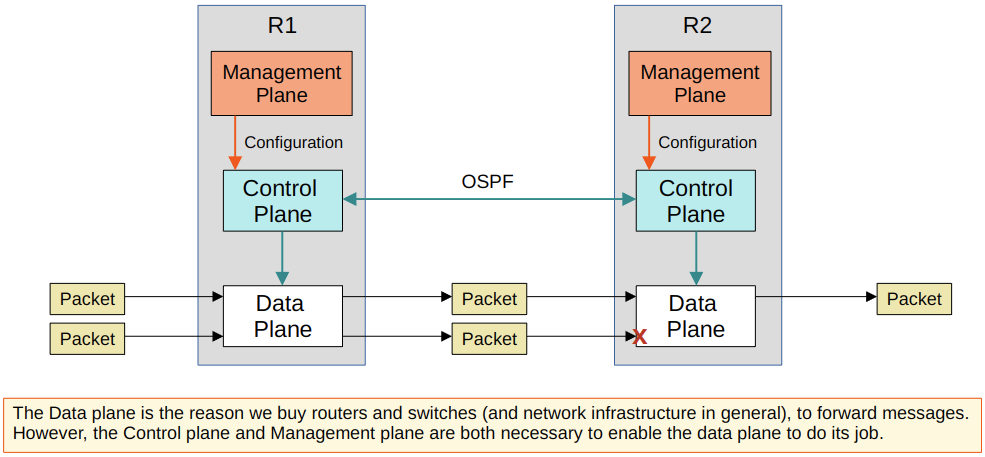
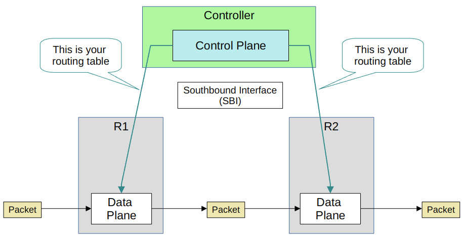
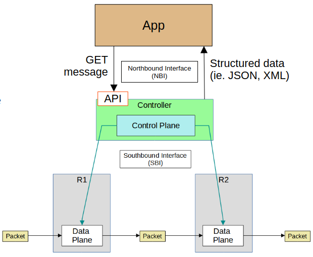

# Network Automation

This lecture is an overview of network automation topics. The following lectures will cover each topic in a bit more depth.

## Benefits of Network Automation

- Human error is reduced
  - Typos
- Networks become much more scalable
  - New deployments, network-wide changes, and troubleshooting can be implemented in a fraction of the time
- Network-wide policy compliance can be assured
  - Standard configurations, software versions, etc
- The improved efficiency of network operations reduces the opex (operating expenses) of the network
  - Each task requires fewer man-hours

## Logical 'Planes' of Network Functions

- The various functions of network devices can be logically divided up (categorised) into *planes*:
  - Data plane
  - Control plane
  - Management plane
- The operations of the Management plane and Control plane are usually managed by the CPU
- However, it is not desirable for data plane operations because CPU processing is slow (relatively speaking)
- Instead, a specialised hardware **ASIC (Application-Specific Integrated Circuit)** is used.
  - ASICs are chips built for specific purposes
- Using a switch as an example
  - When a frame is received, the ASIC (not the CPU) is responsible for the switching logic
  - The MAC address table is stored in a type of memory called TCAM (Ternary Content-Addressable Memory)
    - Another name for the MAC address table is *CAM table*
  - The ASICfeeds the destination MAC address of the frame into the TCAM, which returns the matching MAC address table entry
  - The frame is then forwarded out of the appropriate interface
- Modern routers also use a similar hardware data plane
  - An ASIC designed for forwarding logic, and tables stored in TCAM

### Data Plane

- All tasks involved in forwarding user data/traffic from one interface to another are part of the **data plane**
  - A router receives a message, looks for the most specific matching route in its routing table, and forwards it out of the appropriate interface to the next hop
    - It also de-encapsulates the original Layer 2 header, and re-encapsulates with a new header destined for the next hop's MAC address
  - A switch receives a message, looks at the destination MAC address, and forwards it out of the appropriate interface (or floods it)
    - This includes functions like adding or removing 802.1q VLAN tags
  - NAT, changing the src/dst addresses before forwarding, is part of the data plane
- Deciding to forward or discard messages due to ACLs, port security, etc. is part of the data plane
- The data plane is also called the **forwarding plane**

### Control Plane

- How does a device's data plane make its forwarding decisions?
  - Routing table, MAC address table, ARP table, STP, etc.
- Functions that build these tables are part of the **control** plane
  - Other functions that influence the data plane also fit here
- The control plane *controls* what the data plane does
  - For example, building the routing table
- The control plane performs *overhead* work
  - OSPF itself doesn't forward user data packets, but it informs the data plane about packets should be forwarded
  - STP itself isn't directly involved in the process of forwarding frames, but it informs the data plane about which interfaces should and shouldn't be used to forward frames
  - ARP messages aren't user data, but they are used to build an ARP table which is used in the process of forwarding data
- In traditional networking, the data plane and control plane are both distributed
  - Each device has its own data plane and control plane
  - The planes are 'distributed' throughout the network

### Management Plane

- Like the control plane, the **management plane** performs overhead work
  - However the management plane doesn't directly affect the forwarding of messages in the data plane
- The management plane consists of protocols that are used to manage devices
  - SSH/Telnet
    - Used to connect to the CLI of a device to configure/manage it
  - Syslog
    - Used to keep logs of events that occur on the device
  - SNMP
    - Used to monitor the operations of the device
  - NTP
    - Used to maintain accurate time on the device

## Soft-Defined Networking (SDN)

- **Software-Defined Networking (SDN)** is an approach to networking that centralised the control plane into an application called a *controller*
  - Very similar in concept to a Wireless LAN Controller
  - SDN is also called **Software-Defined Architecture (SDA)** or **Controller-Based Networking**
- Traditional control planes use a distributed architecture
  - For example, each router in the network runs OSPF and the routers share routing information and then calculate their preferred routes to each destination
- An SDN controller centralises control plane functions like calculating routes
  - How much of the control plane is centralised varies greatly
- The controller can interact programmatically with the network devices used APIs

### Southbound Interface (SBI)

- The SBI is used for communications between the controller and the network devices it controls
- It typically consists of a communication protocol and API
- APIs facilitate data exchanges between programs
  - Data is exchanged between the controller and the network devices
  - An API on the network devices allows the controller to access information on the devices, control their data plane tables, etc.
- Examples of SBIs:
  - OpenFLow
  - Cisco OpFlex
  - Cisco onePK (Open network Environment Platform Kit)
  - NETCONF

### Northbound Interfaces

- Using the SBI, the controller communicates with the managed devices and gathers information about them
  - The devices on the network
  - The topology
  - The available interfaces on each device
  - Their configurations
- The **Northbound Interface (NBI)** is what allows the engineer to interact with the controller
  - Access the data it gathers about the network
  - Program it
  - Make changes in the network via the SBI
- A *REST API* is used on the controller as an interface for apps to interact with it
  - Representational State Transfer
- Data is sent in a structured (serialised) format such as JSON or XML

## Automation in Traditional Networks vs Soft-Defined Networking

- Networking tasks can be automated in traditional network architectures
  - Scripts can be written to push commands to many devices at once
- However, the robust and centralised data collected by SDN controllers greatly facilitates these functions
  - The controller collects information about all devices in the network
  - Northbound APIs allow apps to access information in a format that is easy for programs to understand
    - JSON, XML
  - The centralised data facilitates network-wide analytics
- SDN tools can provide the benefits of automation without the requirement of third-party scripts and apps
  - You don't need expertise in automation to make use of SDN tools
  - However, APIs allow third-party applications to interact with the controller, which can be very powerful
- Although SDN and automation aren't the same thing, the SDN architecture greatly facilitates the automation of various tasks in the network via the SDN controller and APIs
