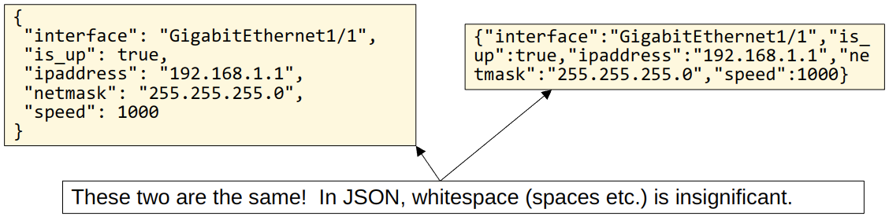
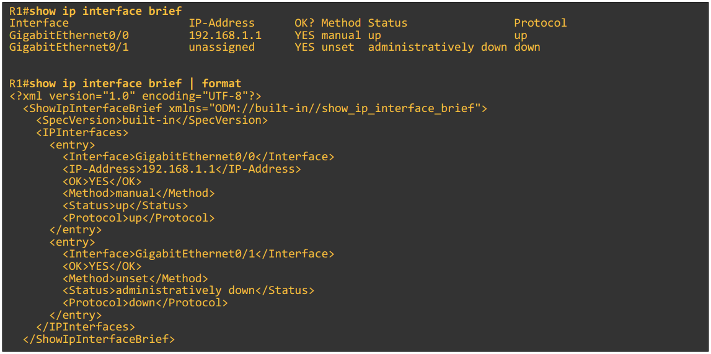
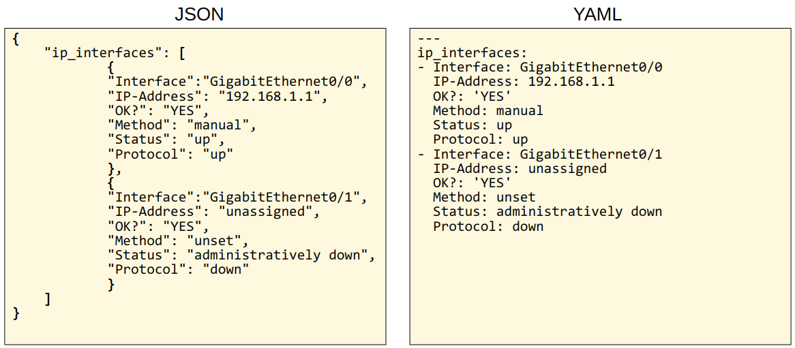

# JSON, XML & YAML

- Data serialisation is the process of converting data into a standardised format/structure that can be stored (in a file) or transmitted (over a network) and reconstructed later (ie. by a different application)
- This allows the data to be communicated between applications in a way both applications understand

## JSON

- **JSON** (JavaScript Object Notation) is an open standard **file formate** and **data interchange formate** that uses human-readable text to store and transmit data objects
- It was standardised in RFC 8259
- It was derived from JavaScript, but it is language-independent and many modern programming languages are able to generate and read JSON data
  - REST APIs often use JSON
- **Whitespace is insignificant**
- JSON can represent four primitive data types
  - String
  - Number
  - Boolean
  - Null
- JSON also has two structured data types
  - Object
  - Array

### JSON Object

- An **object** is an unordered list of *key-value pairs*
  - Object are surrounded by curly brackets `{}`
  - The *key* is a string
  - The *value* is any valid JSON type
    - String, number, boolean, null, object, array
  - The *key* and *value* are separated by a colon `:`
  - If there are multiple *key-value pairs*, each pair is separated by a comma `,`



### JSON Array

- An **array** is a series of *values* separated by commas `,`
  - Not *key-value pairs*
  - The values don't have to be the same data type

```json
{
    "interfaces": [
        "GigabitEthernet1/1",
        "GigabitEthernet1/2",
        "GigabitEthernet1/3"
    ],

    "random_values": [
        "Hi",
        5,
        false
    ]
}
```

## XML

- **XML** (Extensible Markup Language) was developed as a markup language, but is now used as a general data serialisation language
  - Markup languages (ie. HTML) are used to format text (font, size, colour, headings)
- XML is generally less human-readable than JSON
- **Whitespace is insignificant**
- Often used by REST APIs
- `<key>value</key>`



## YAML

- **YAML** originally meant *Yet Another Markup Language*, but to distinguish its purpose as a data-serialization language rather than a markup language, it was repurposed to *YAML Ain't Markup Language*
- YAML is used by the network automation tool *Ansible*
- YAML is very human-readable
- **Whitespace IS SIGNIFICANT**
  - Indentation is very important
  - Unlike JSON and XML
- YAML files start with `---`
- `-` is used to indicate a list
- *key-value pairs* are represented as `key:value`

```yaml
---
ip_interfaces:
- Interface: GigabitEthernet0/0
  IP-Address: 192.168.1.1
  OK?: 'YES'
  Method: manual
  Status: up
  Protocol: up
- Interface: GigabitEthernet0/1
  IP-Address: unassigned
  OK?: 'YES'
  Method: unset
  Status: administratively down
  Protocol: down
```


