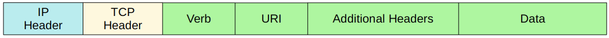
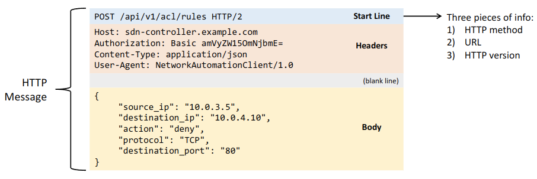
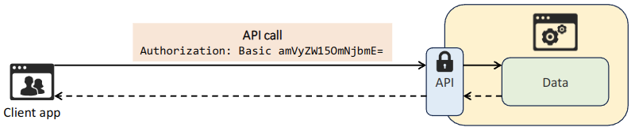
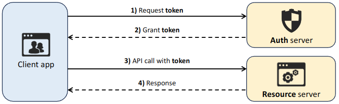
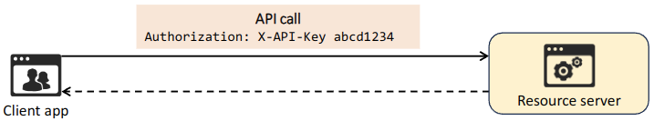
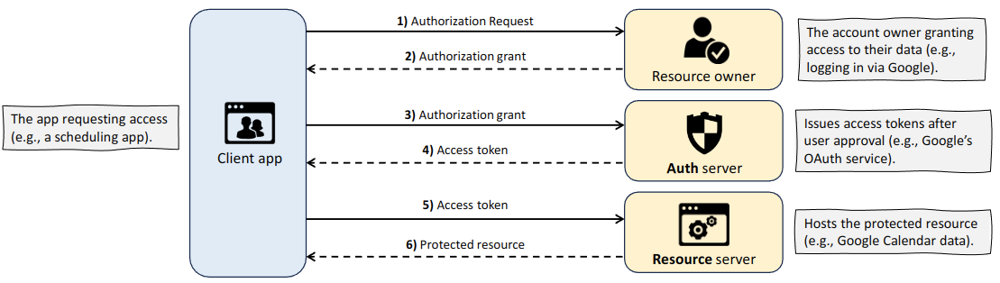

# REST APIs

## Part 1

### CRUD

- CRUD refers to the operations we perform using REST APIs
- **Create**
  - `Create` operations are used to create new variables and set their initial values
    - Create variable `ip_address` and set the value to `10.1.1.1`
- **Read**
  - `Read` operations are used to retrieve the value of a variable
    - What is the value of variable `ip_address`?
- **Update**
  - `Update` operations are used to change the value of a variable
    - Change the value of variable `ip_address` to `10.2.3.4`
- **Delete**
  - `Delete` operations are used to delete variables
    - Delete variable `ip_address`
- HTTP uses *verbs* (aka methods) that to these CRUD operations
- REST APIs typical use HTTP/S

| Purpose                         | CRUD Operation | HTTP Verb      |
|:-------------------------------:|:--------------:|:--------------:|
| Create new variable             | **Create**     | **POST**       |
| Retrieve value of variable      | **Read**       | **GET**        |
| Change the value of variable | **Update**     | **PUT, PATCH** |
| Delete variable                 | **Delete**     | **DELETE**     |

### HTTP

- When an HTTP client sends a request to an HTTP server, the HTTP header includes information like this:
  - An HTTP Verb (ie. GET)
  - A URI (Uniform Resource Identifier), indicating the resource it is trying to access

- The **HTTP Request** can include additional headers which pass additional information to the server
  - An example would be an **Accept** header, which informs the server about the type(s) of data that can be sent back to the client
    - **Accept: application/json**
    - **Accept: application/xml**
  - When a REST client makes an API call (request) to a REST server, it will send an HTTP request
    - REST APIs don't *have* to use HTTP for communication, although HTTP is the most common choice
- The **HTTP Response** will come from the server and include a status code indicating if it succeeded or failed, as well as other details
  - The first digit indicates the class of the response
    - **1xx** *informational* - the request was received, continuing process
      - **102 Processing** indicates that the server has received the request and is processing it, but the response is not yet available
    - **2xx** *successful* - the request was successfully received, understood and accepted
      - **200 OK** indicates that the request succeeded
      - **201 Created** indicates that the request succeeded and a new resource was created (ie in response to POST)
    - **3xx** *redirection* - further action needs to be taken in order to complete the request
      - **301 Moved Permanently** indicates that the requested resource has been moved, and the server indicates its new location
    - **4xx** *client error* - the request contains bad syntax or cannot be fulfilled
      - **401 Unauthorized** means the client must authenticate to get a response
      - **404 Not Found** means the requested resource was not found
    - **5xx** *server error* - the server failed to fulfill an apparently valid request
      - **500 Internal Server Error** means the server encountered something unexpected that it doesn't know how to handle

### REST

- REST stands for Representational State Transfer
- **REST APIs** are also known as **REST-based APIs** or **RESTful APIs**
  - REST isn't a specific API
  - Instead, it describes a set of rules about how the API should work
- The six constraints of RESTful architecture are:
  - Uniform Interface
  - Client-server
  - Stateless
  - Cacheable or non-cacheable
  - Layered system
  - Code-on-demand (optional)

#### REST: Client-Server

- **REST APIs** use a client-server architecture
- The client uses API calls (HTTP requests) to access the resources on the server
- The separation between the client and server means they can both change and evolve independently of each other
  - When the client application changes or the server application changes, the interfaces between them must not break

#### REST: Stateless

- **REST API** exchanges are stateless
- This means that each API exchange is an independent even of all past exchanges between the client and server
  - The server does not store information about previous requests from the client to determine how it should response to new requests
  - If authentication is required, the client must authenticate with the server for each request it makes
- TCP is an example of a stateful protocol
  - A connection is established
  - Each packet has a sequence number
- UDP is an example of stateless
  - Date is sent
- *Although REST APIs use HTTP/S, which uses TCP (stateful) as its Layer 4 protocol, HTTP and REST APIs themselves aren't stateful. The functions of each layer are separate!

#### REST: Cacheable or Non-Cacheable

- **REST APIs** must support caching of data
- *Caching* refers to storing data for future use
  - This improves performance for the client and reduces the load of the server
- Not all resources have to be cacheable, but cacheable resources MUST be declared as cacheable

## Part 2 - REST API Authentication

- REST APIs used various types of authentication to verify client identity and secure access to resources
  - These are also called **methods** or **schemes**
- Four type of authentication for the CCNA are:
- **Basic Authentication**
  - Sends a username and password in every request, encoded in Base64
- **Bearer Authentication**
  - Uses a toke (bearer token) as an HTTP header in each request to verify the client's identity
- **API Key Authentication**
  - Requires a unique, static key, typically included as an HTTP header, to authenticate API requests
- **OAuth2.0**
  - A secure framework that grants access via access tokens, commonly used for delegated access and third-party authentication

### Basic Authentication

- **Basic Authentication** includes a username and password in the HTTP header of each API request for authentication
- These credentials are **encoded** in Base64 format, but not **encrypted**
  - Easily decoded
  - Always use HTTPS (TLS) for security
- The username and password are sent in the format `username:password`, encoded in Base64
  - For example, `jeremy:ccna` would be sent as `amVyZW15OmNjbmE=`
- **Advantages**
  - Simple and easy to implement
- **Disadvantages**
  - Since credentials are sent in every request, attackers could steal them if the connection is not properly secured
  - Even if using HTTPS for encryption, relying solely on a `user:pass` combination isn't particularly secure

### Bearer Authentication

- **Bearer Authentication** is a form of token-based authentication
  - A **token** is used instead of a `user:pass`
  - The client first obtains a token by authenticating with an authorisation server
    - This can be done using **basic authentication** or another method
  - For each API call, the client includes the token in the HTTP Authorisation header
    - `Authorization: Bearer ya29.a0ARrdaM8`
- The term **bearer** means that anyone who possesses the token can use it
  - If an attacker steals the token, they can make API calls as if they were the legitimate user
  - To mitigate against this, **tokens expire** after a set period of time
- **Advantages**
  - More secure than **Basic Authentication** (no need to transmit the same `user:pass` for every API call)
  - Tokens expire, so a stolen token will only be temporarily valid
- **Disadvantages**
  - If a token is stolen, the attacker can access the API until it expires
  - Tokens need to be refreshed periodically, adding extra complexity to implement
  - Should only be used with HTTPS

### API Key Authentication

- **API Key Authentication** uses a **static key** issued by the API provider
  - The client uses this key in each API call for authentication
  - Unlike **bearer tokens**, the **API key** is static and remains valid until revoked
- API keys can be sent in:
  - The HTTP Authorisation header (recommended, with HTTPS)
  - The URL (e.g., add `?api_key=abcd1234` to the end of the URL)
    - Not recommended! URLs are often logged by web servers, proxies, browsers, etc.
  - A cookie (sometimes used for browser-based APIs)
- **Advantages**
  - Easier to implement than **Bearer Authentication** (no need to refresh tokens)
  - Good for tracking API usage
    - Often used by cloud services and third-party APIs
- **Disadvantages**
  - If stolen, the key grants full access until revoked
  - API key must be rotated manually to maintain security, whereas tokens expire automatically

### OAuth2.0

- **OAuth 2.0** is a secure authentication framework that is widely used in modern web applications
  - It provides *access delegation*, granting third-party applications **limited access** to resources on behalf of the resource's owner
    - There is no need to share the resources owner's credentials with the third party
- The **OAuth2.0** authentication and authorisation process consists of six steps
  1. **Client app** requests authorisation from the resource owner (you) to access the resource (eg. your Google Calendar data)
  2. **Resource owner** grants authorisation by logging into their account (eg. Google account) and giving permission
  3. **Client app** exchanges the authorisation grant for an access token from the auth server
  4. **Auth server** provides an access token to the client app
  5. **Client app** sends the access token to the resource server (eg. Google's server hosting calendar data) to request the resource
  6. **Resource server** validates the access token and provides the requested resource (calendar data) to the client app
- The **access token** granted in step 4 functions just like the token used in **bearer authentication**
  - It grants access to the specified resource within the appropriate scope of access (eg read-only access)
  - Access tokens expire after a short period, OAuth2.0 uses **refresh tokens** (granted by the Auth server) to obtain new access tokens without requiring the user to log in every time.

