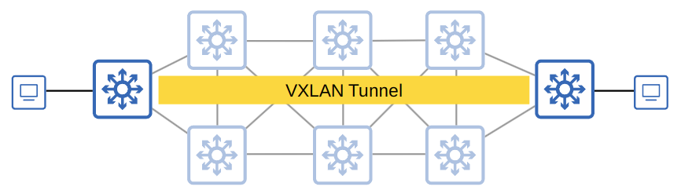

# Software-Defined Networking

- **Software-Designed Networking** is an approach to networking that centralised the control plane into an application called a *controller*
- Traditional control planes use a distributed architecture
- An SDN controller centralises control plane functions like calculating routes
- The controller can interact programmatically with the network devices using APIs
- The **SBI** is used for communications between the controller and the network devices it controls
- The **NBI** is what allows us to interact with the controller with our scripts and applications

## SD-Access

- Cisco **SD-Access** is Cisco's SDN solution for automating campus LANs
  - ACI (Application Centric Infrastructure) is their SDN solution for automating data centre networks
  - SD-WAN is their SDN solution for automating WANs
- Cisco **DNA (Digital Network Architecture) Center** is the controller at the centre of SD-Access
- The **Underlay** is the underlying physical network of devices and connections which provide connectivity
  - Includes wired and wireless
  - Uses IS-IS for connectivity
- The **Overlay** is the virtual network built on top of the physical underlay network
  - SD-Access uses **VXLAN** (Virtual Extensible LAN) to build tunnels
- The **Fabric** is the combination of the overlay and underlay
  - The physical and virtual network as a whole

## SD-Access Underlay

- The underlay's purpose is to support the VXLAN tunnels of the overlay
- There are three different roles for switches in SD-Access
  - **Edge nodes** - Connect to end hosts
  - **Border nodes** - Connect to devices outside of the SD-Access domain (ie. WAN router)
  - **Control nodes** - Use **LISP** (Locator ID Separation Protocol) to perform various control plan functions
- You can add SD-Access on top of an existing network (*brownfield deployment*) if your network hardware and software support it
  - DNA Center won't configure the underlay in this case
- A new deployment (*greenfield deployment*) will be configured by DNA Centre to use to optimal SD-Access underlay
  - All switches are Layer 3 and use  IS-IS as their routing protocol
  - All links between switches are routed ports
    - No STP needed!
  - Edge nodes (access switches) act as the default gateway of end hosts
    - This means there is a routed access layer
- LISP provides the control plane of SD-Access
  - A list of mappings of **EID**s (Endpoint Identifiers) to **RLOC**s (Routing LOCators) is kept
    - **EID**s identify end hosts connected to edge switches
    - **RLOC**s identify the edge switch which can be used to reach the end host
- Cisco TrustSec (CTS) provides policy control
  - QoS, security policy, etc
- VXLAN provides the data plane of SD-Access

## Cisco DNA Center

- Cisco DNA Center has two main roles
  - The SDN controller in SD-Access
  - A network manager in a traditional network (non-SD-Access)
- DNA Center is an application installed on Cisco UCS server hardware
- It has a REST API which can be used to interact with DNA center
- The SBI supports protocols such as:
  - NETCONF
  - RESTCONF
  - Telnet
  - SSH
  - SNMP
- DNA Center enables ***Intent-Based Networking*** (IBN)
  - The goal is to allow the engineer to communicate their intent for network behaviour to DNA Center, and then DNA Center will take care of the details of the actual configurations and policies on devices
  - Traditional security policies using ACLs can become very cumbersome
    - ACLs can have thousands of entries
    - The intent of entries is forgotten with time (as engineers leave and new come in)
    - Configuring and applying ACLs correctly across a network is cumbersome and leaves room for error
  - DNA Center allows the engineer to specify the intent of the policy and DNA Center will take care of the exact details of implementing policy
    - This group of users can't communicate with this group
    - That group of users can't access this server, but they can that

## DNA Center vs Traditional Network Management

### Traditional Network Management

- Devices are configured one-by-one via SSH or console connection
- Devices are manually configured via console connection before being deployed
- Configurations and policies are managed per-device (distributed)
- New network deployments can take a long time due to the manual effort required
- Errors and failures are more likely due to increased manual effort

### DNA Center-based Network Management

- Devices are centrally managed and monitored from the DNA Center GUI or other applications using its REST API
- The administrator communicates their intended network behaviour to DNA Center, which changes those intentions into configurations on the manged network devices
- Configurations and policies are centrally managed
- Software versions are also centrally managed
  - DNA Center can monitor cloud servers for new versions and then update the managed devices
- New network deployments are much quicker
  - New devices can automatically receive their configurations from DNA Center without manual configuration
