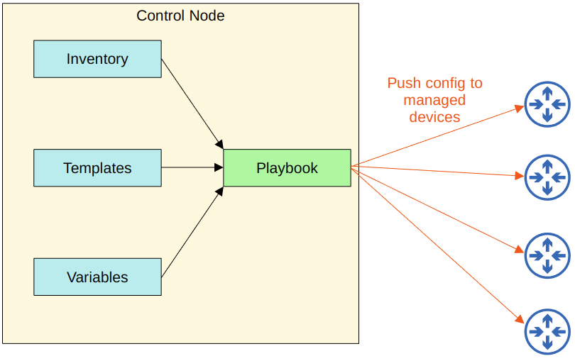

# Ansible

The lesson is actually titled Ansible, Puppet, Chef. Puppet and Chef have been removed with v1.1 so I am not taking notes on that and I am removing the flashcards in relation to it.

## Configuration Drift

- *Configuration drift* is when individual changes made over time cause a device's configuration to deviate from the standard/correct configurations as defined by the company
  - Although each device wil have unique parts of its configuration (IP addresses, hostname etc.), most of a devices configuration is usually defined in standard templates designed by the network architects/engineers of the company
  - As individual engineers make changes to devices (troubleshooting and fixing issues, or testing configurations), the configuration of a device can drift away from the standard
  - Records of these individual changes and their reasons aren't normally documented
  - This can lead to future issues
- Even without automation tools, it is best to have standard *configuration management* practices

## Configuration Provisioning

- *Configuration Provisioning* refers to how configuration changes are applied to devices
  - This includes configuring new devices, too
- Traditionally, configuration provisioning is done by connecting to devices one-by-one via SSH
  - Not practical in large networks
- Configuration management tools like Ansible allow us to make changes to devices on a mass scale with a fraction of the time and effort
- There are two essential components: *templates* and *variables*

## Configuration Management Tools

- *Configuration Management Tools* are network automation tools that facilitate the centralised control of large numbers of network devices
- These tools were originally developed after the rise of VMs, to enable server admins to automate the process of creating, configuring, and removing VMs
  - However, they are also widely used to manage network devices
- These tools can be used to perform tasks such as:
  - Generate configurations for new devices on a large scale
  - Perform configuration changes on devices
    - All devices on your network, or just a certain subset of devices
  - Check device configurations for compliance with defined standards
  - Compare configurations between devices, and between different versions of configurations on the same device

## Ansible

- Ansible is a configuration tool owned by Red Had
- Ansible itself is written in Python
- Ansible is **agentless**
  - It doesn't require any special software to run on the managed devices
  - Ansible uses SSH to connect to devices, make configuration changes, extract information, etc.
- Ansible uses a **Push** model
  - The Ansible server (**Control Node**) uses SSH to connect to managed devices and **Push** configuration changes to them
- After installing Ansible itself, you must create several text files:
  - **Playbooks**
    - These files are 'blueprints of automation tasks'
    - They outline the logic and actions of the tasks that Ansible should do
    - Written in YAML
  - **Inventory**
    - These files list the devices that will be managed by Ansible
    - As well as characteristics of each device, such as their device rol (access switch, core switch, firewall, etc.)
    - Written in INI, YAML or other formats
  - **Templates**
    - These files represent a device's configuration file, but specific values for variables are not provided
    - Written in **Jinja2** format
  - **Variables**
    - These files list variables and their values
    - These values are substituted into the templates to create complete configuration files
    - Written in YAML

